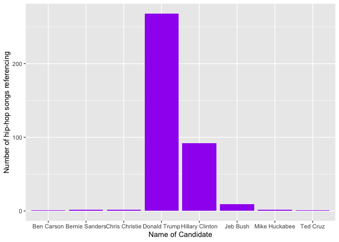
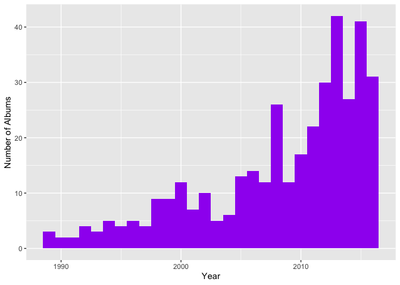
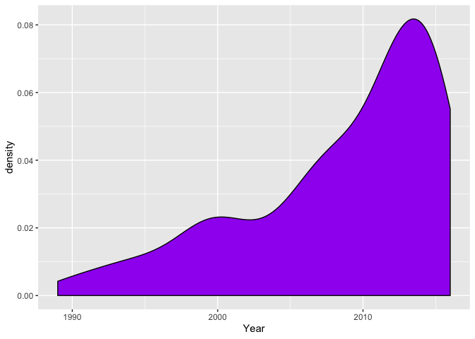
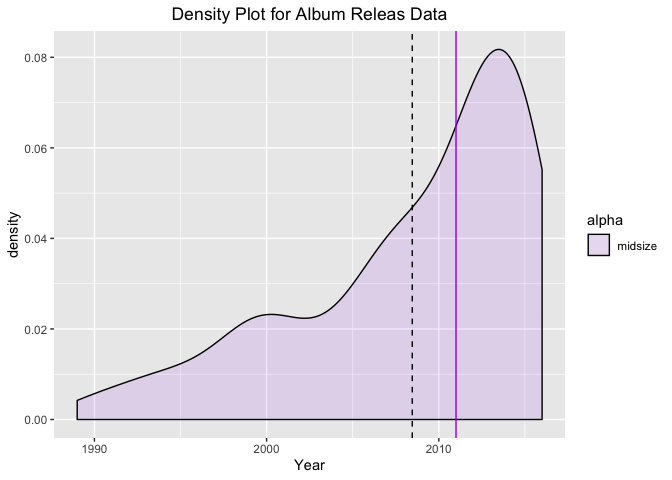
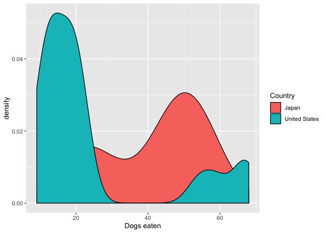
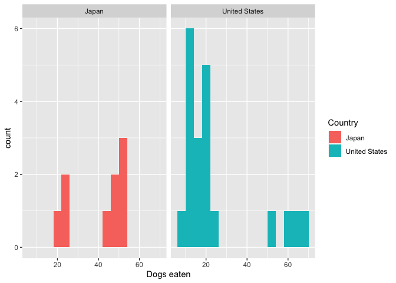
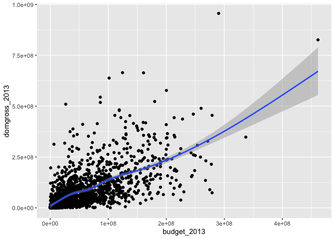
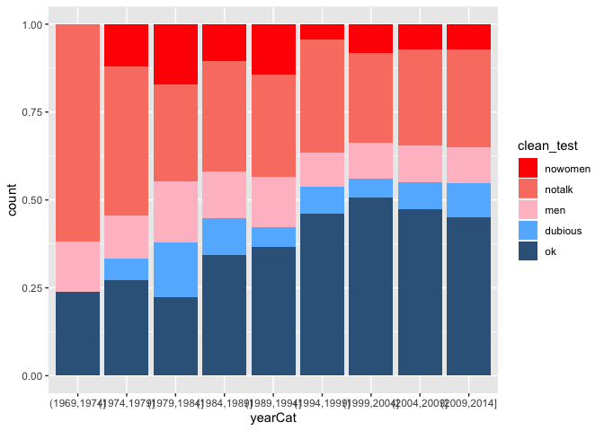

```r
library(esquisse)
library(tidyverse)
library(fivethirtyeight)
library(knitr)
library(gridExtra)
library(ggridges)
```

# Activity 02: Univariate Visualization

## Exercise 4

**Exercise 4.1**
In July 2016, fivethirtyeight.com published the article ["Hip-Hop is Turning on Donald Trump""](https://projects.fivethirtyeight.com/clinton-trump-hip-hop-lyrics/).  The supporting data table, `hiphop_cand_lyrics`, is from the `fivethirtyeight` package. 

a. What are the *cases* in this data set?    

- hip-hop songs referencing POTUS candidates in 2016

b. Find the number of cases in `hiphop_cand_lyrics` 


```r
nrow(hiphop_cand_lyrics)
```

```
## [1] 377
```

c. List the names of all variables in `hiphop_cand_lyrics`

```r
colnames(hiphop_cand_lyrics)
```

```
## [1] "candidate"          "song"               "artist"            
## [4] "sentiment"          "theme"              "album_release_date"
## [7] "line"               "url"
```

**Exercise 4.2**
Let's start our investigation of hip hop data by asking "Who?"; that is, let's identify patterns in which 2016 presidential candidates popped up in hip hop lyrics.
  a. Construct a table of the number of cases that fall into each `candidate` category.    

```r
hiphop_cand_lyrics %>% 
  count(candidate)
```

```
## # A tibble: 8 x 2
##   candidate           n
##   <chr>           <int>
## 1 Ben Carson          1
## 2 Bernie Sanders      2
## 3 Chris Christie      2
## 4 Donald Trump      268
## 5 Hillary Clinton    92
## 6 Jeb Bush            9
## 7 Mike Huckabee       2
## 8 Ted Cruz            1
```
  
  b. Construct a single plot that allows you to investigate the prevalence of each candidate in hip hop.  Make the following modifications:    
    - change the axis labels    
    - change the fill colors

```r
ggplot(data = hiphop_cand_lyrics, aes(x=candidate)) + 
  geom_bar(fill = 'purple')+
  labs(x="Name of Candidate", y="Number of hip-hop songs referencing")
```

<!-- -->
  
  c. Summarize your findings about the 2016 candidates in hip hop.

- Donald Trump is most popular for the hip-hop songs referencing POTUS candidates in 2016.(Hip-Hop Is Turning On Donald Trump)
- The second popular candidate in hip-hop is Hillary Clinton.

**Exercise 4.3**
Next, consider the release dates of the hip hop songs.    
  
  a. Construct a histogram of the release dates with the following modifications:   
    - change the fill color of the bins    
    - change the bin width to a meaningful size    

```r
  ggplot(hiphop_cand_lyrics, aes(x=album_release_date)) +
        geom_histogram(fill="purple", binwidth=1) +
        labs(x="Year", y="Number of Albums")
```

<!-- -->
 
  b. Construct a density plot of the release dates with the following modifications:
    - change the fill color    

```r
ggplot(hiphop_cand_lyrics, aes(x=album_release_date)) +
        geom_density(fill="purple") +
        labs(x="Year")
```

<!-- -->
  
  c. Summarize your findings about release date

- The number of albums released each year varies. 
- The number of albums released each year has an overall increasing tendency from 1989 to 2016.


**Exercise 4.4**
No class will teach you everything you need to know about RStudio or programming in general. Thus, being able to find help online is an important skill.  To this end, make a single visualization that incorporates the following modifications to your density plot from above.  This will require a little Googling and/or use of the visualization cheat sheet.    

  - Add a title or caption.    
  - Add *transparency* to the fill color.    
  - Calculate the mean (ie. average) release date and median release date:

```r
  mean(hiphop_cand_lyrics$album_release_date)
  median(hiphop_cand_lyrics$album_release_date)
```
Add two vertical lines to your plot: one representing the mean and the other representing the median. Use two different colors and/or line types.   


```r
ggplot(hiphop_cand_lyrics, aes(x=album_release_date)) +
        geom_density(fill="purple", mapping = aes(alpha="midsize")) +
        labs(x="Year")+
        ggtitle("Density Plot for Album Releas Data")+
        theme(plot.title = element_text(hjust = 0.5))+
        geom_vline(xintercept=mean(hiphop_cand_lyrics$album_release_date), linetype='dashed')+
        geom_vline(xintercept=median(hiphop_cand_lyrics$album_release_date), color='purple')
```

```
## Warning: Using alpha for a discrete variable is not advised.
```

<!-- -->

# Activity 03: Bivariate Visualization

## 6 Practice
## 6.1 Hot Dogs

In the annual Nathan's hot dog eating contest, people compete to eat as many hot dogs as possible in ten minutes.  Data on past competitions were compiled by Nathan Yau for "Visualize This: The FlowingData Guide to Design, Visualization, and Statistics": 


```r
hotdogs <- read_csv("http://datasets.flowingdata.com/hot-dog-contest-winners.csv")
```

**Exercise 6.1**

a. Construct a visualization of the winning number of hot dogs by year. THINK: Which is the response variable?      

response variable: 'Dogs eaten'

```r
ggplot(hotdogs, aes(x=Year, y=`Dogs eaten`)) +
      geom_point()
```

<!-- -->


b. Temporal trends are often visualized using a line plot.  Add a `geom_line()` layer to your plot from part (a).       


```r
ggplot(hotdogs, aes(x=Year, y=`Dogs eaten`)) +
      geom_point() +
      geom_line()
```

<!-- -->

c. Summarize your observations about the temporal trends in the hot dog contest. 

- Overall, the number of hot dogs eaten by the winner each year has an increase tendency.

- The number of hot dogs eaten by the winner in 2001 skyrocketed in comparison with 2000.

**Exercise 6.2**

All but two of the past winners are from the U.S. or Japan:


```r
hotdogs %>% 
  count(Country)
```

```
## # A tibble: 4 x 2
##   Country           n
##   <chr>         <int>
## 1 Germany           1
## 2 Japan             9
## 3 Mexico            1
## 4 United States    20
```

Use the following code to *filter* out just the winners from U.S. and Japan and name this `hotdogsSub`.  (Don't worry about the code itself - we'll discuss similar syntax later in the semester!)    


```r
hotdogsSub <- hotdogs %>% 
    filter(Country %in% c("Japan","United States"))
```

a. Using a density plot approach *without* facets, construct a visualization of how the number of hot dogs eaten varies by country.

```r
ggplot(hotdogsSub, aes(x=`Dogs eaten`, fill=Country)) +
    geom_density()
```

<!-- -->

b. Repeat part a using a density plot approach *with* facets. 

```r
ggplot(hotdogsSub, aes(x=`Dogs eaten`, fill=Country))+
    geom_density()+
    facet_wrap(~Country)
```

<!-- -->

c. Repeat part a using *something other than* a density plot approach.  (There are a few options!)    

```r
ggplot(hotdogsSub, aes(x=`Dogs eaten`, fill=Country))+
    geom_bar(binwidth=4) +
    facet_wrap(~Country)
```

```
## Warning: `geom_bar()` no longer has a `binwidth` parameter. Please use
## `geom_histogram()` instead.
```

<!-- -->

d. Summarize your observations about the number of hot dogs eaten by country.   

- The number of hot dogs eaten winners with the record less than 30 in the United States is more than the number of winners in Japan.

- The number of hot dogs eaten winners with the record larger than 60 in the United States is more than the number of winners in Japan.

- The number of hot dogs eaten winners with the record between 20 and 60 in the United States is less than the number of winners in Japan.


## 6.2 The Bechdel Test

Recall the "Bechdel test" data from the previous activity.  As a reminder, the “Bechdel test” tests whether movies meet the following criteria:    

* there are $\ge$ 2 female characters    
* the female characters talk to each other    
* at least 1 time, they talk about something other than a male character    

In the fivethirtyeight.com article ["The Dollar-And-Cents Case Against Hollywood's Exclusion of Women"](http://fivethirtyeight.com/features/the-dollar-and-cents-case-against-hollywoods-exclusion-of-women/), the authors analyze which Hollywood movies do/don't pass the test.  Their data are available in the `fivethirtyeight` package:    


```r
data(bechdel)
```
    
In investigating budgets and profits, the authors "focus on films released from 1990 to 2013, since the data has significantly more depth since then."  Use the following code to filter out just the movies in these years and name the resulting data set `Beyond1990` (don't worry about the syntax):    


```r
Beyond1990 <- bechdel %>% 
    filter(year >= 1990)
```

**Exercise 6.3**

a. Construct a visualization that addresses the following research question: Do bigger budgets (`budget_2013`) pay off with greater box office returns (`domgross_2013`)?  In constructing this visualization, add a smooth to highlight trends and pay attention to which of these variables is the response.       

```r
Beyond1990 %>% 
  drop_na(budget_2013, domgross_2013) %>% 
  ggplot(aes(x=`budget_2013`, y=`domgross_2013`))+
    geom_point() +
    geom_smooth(method = 'gam', formula=y ~ s(x, bs = "cs"))
```

<!-- -->

b. Using your visualization as supporting evidence, answer the research question.  

- Overall, it turns out the higher the budget of a movie, the higher the higher domestic gross. Therefore it can be concluded that "bigger budgets pay off with greater box office returns".

c. Part of the fivethirtyeight article focuses on how budgets (`budget_2013`) differ among movies with different degrees of female character development (`clean_test`).  Construct a visualization that highlights the relationship between these two variables.  There are many options - some are better than others!       

```r
ggplot(Beyond1990, aes(x=`budget_2013`, y=clean_test, fill=clean_test))+
  geom_density_ridges(scale = 2, bandwidth=15700000) +
  scale_fill_manual(values=c("blue","purple","red", "green","yellow"))
```

<!-- -->

d. Using your visualization as supporting evidence, address fivethirtyeight's concerns. 

- Though the overall relationships betwewen the budget of movies and Bechdel test results are similar, movie companies pay higher budget for movies without woman or movies which women don't talk to each other than others.


**Excersie 6.4**

NOTE: The following exercise is inspired by a similar exercise proposed by Albert Kim, one of the `fivethirtyeight` package authors.    
    Return to the fivethirtyeight.com article and examine the plot titled "The Bechdel Test Over Time".    

a. Summarize the trends captured by this plot.  (How has the representation of women in movies evolved over time?)   

- Over time, the percent of the pass of the Bachdel test that  represents women are involved in movies, is increasing.

b. Recreate this plot!  To do so, you'll need to create a new data set named `newbechdel` in which the order of the Bechdel categories (`clean_test`) and the year categories (`yearCat`) match those used by fivethirtyeight.  Don't worry about the syntax:  
  

```r
newbechdel <- bechdel %>% 
  mutate(clean_test=factor(clean_test, c("nowomen","notalk","men","dubious","ok"))) %>% 
  mutate(yearCat=cut(year, breaks=seq(1969,2014,by=5)))

ggplot(newbechdel, aes(x=yearCat,fill=clean_test))+
  geom_bar(position="fill") +
  scale_fill_manual(values = c("red","salmon","pink","steelblue1","steelblue4"))
```

<!-- -->
   
    Further, you'll need to add the following layer in order to get a color scheme that's close to that in the article:    

```    
scale_fill_manual(values = c("red","salmon","pink","steelblue1","steelblue4"))
```   
    
NOTE that your plot won't look *exactly* like the authors', but should be close to this:    
    

