```r
library(dsbox) 
library(nycflights13) 
library(ggmosaic) 
```

```
## Loading required package: ggplot2
```

```r
library(tidyverse)
```

```
## ── Attaching packages ───────────────────────────── tidyverse 1.2.1 ──
```

```
## ✔ tibble  2.1.3     ✔ purrr   0.3.2
## ✔ tidyr   1.0.0     ✔ dplyr   0.8.3
## ✔ readr   1.3.1     ✔ stringr 1.4.0
## ✔ tibble  2.1.3     ✔ forcats 0.4.0
```

```
## ── Conflicts ──────────────────────────────── tidyverse_conflicts() ──
## ✖ dplyr::filter() masks stats::filter()
## ✖ dplyr::lag()    masks stats::lag()
```

```r
library(gridExtra) 
```

```
## 
## Attaching package: 'gridExtra'
```

```
## The following object is masked from 'package:dplyr':
## 
##     combine
```

```r
library(ggridges)
```

```
## 
## Attaching package: 'ggridges'
```

```
## The following object is masked from 'package:ggplot2':
## 
##     scale_discrete_manual
```

```r
library(tidyverse)
library(devtools) 
```

```
## Loading required package: usethis
```

```r
library(openintro)
```

```
## Please visit openintro.org for free statistics materials
```

```
## 
## Attaching package: 'openintro'
```

```
## The following object is masked from 'package:ggplot2':
## 
##     diamonds
```

```
## The following objects are masked from 'package:datasets':
## 
##     cars, trees
```

```r
library(maps) 
```

```
## 
## Attaching package: 'maps'
```

```
## The following object is masked from 'package:purrr':
## 
##     map
```

```r
library(ggthemes)
library(ggmap) 
```

```
## Google's Terms of Service: https://cloud.google.com/maps-platform/terms/.
```

```
## Please cite ggmap if you use it! See citation("ggmap") for details.
```

## Activity 4: Multivariate Visualization

### Exercise 2.3 

In this exercise, we would like to examine how departure delay varies.

a. Create a boxplot that examines how departure delay varies across hour. Be sure to make hour a factor by using factor(hour). Use coord_cartesian() to zoom in the plot from a delay from 30 minutes ahead to 300 minutes behind. Make better x and y labels. Explore some themes and choose one that you think looks nice and explain why - it’s ok to use the default if that’s what you decide you like best. Suppress the warning message. Describe what you observe.


```r
top_five_dest <- 
  flights %>% 
  count(dest) %>% 
  arrange(desc(n)) %>% 
  slice(1:5) %>% 
  pull(dest)

flights_top_five_dest <- flights %>% 
  filter(dest %in% top_five_dest)

flights_top_five_dest %>% 
  ggplot(aes(x = factor(hour), y=dep_delay)) + 
    geom_boxplot()+
    coord_cartesian(ylim = c(-30, 300))+
    labs(x = "Time of scheduled departure(hours)",
         y = "Departure Delay (minutes)")+
    theme_classic()
```

```
## Warning: Removed 1615 rows containing non-finite values (stat_boxplot).
```

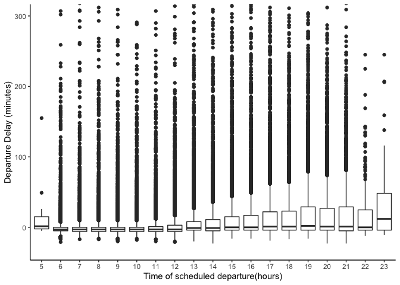<!-- -->

```r
# I chose to use the classic theme because it is the most concise theme so that everyone couold observe the visualization directly and clearly. 
# Observation: Overall from a delay from 30 minutes ahead to 300 minutes behind, the variation of departure delay becames larger, reflected by bothe the IQR and outliers.
```


b. Build on the plot you created in the previous part. Now, use faceting so you can see how this changes by destination. You may want to change the fig.height and fig.width inside the code chunk options. If you click on the cog near the run arrow in the code chunk, and turn on Use custom figure size, you can type in the figure height and width and it will add it to your code chunk options. This is a good way to start adding chunk options until you get used to it. Describe anything interesting you observe in your plot.


```r
flights_top_five_dest %>% 
  ggplot(aes(x = factor(hour), y=dep_delay)) + 
    geom_boxplot()+
    coord_cartesian(ylim = c(-30, 300))+
    labs(x = "Time of scheduled departure(hours)",
         y = "Departure Delay (minutes)")+
    theme_classic()+
  facet_wrap( ~ dest)
```

```
## Warning: Removed 1615 rows containing non-finite values (stat_boxplot).
```

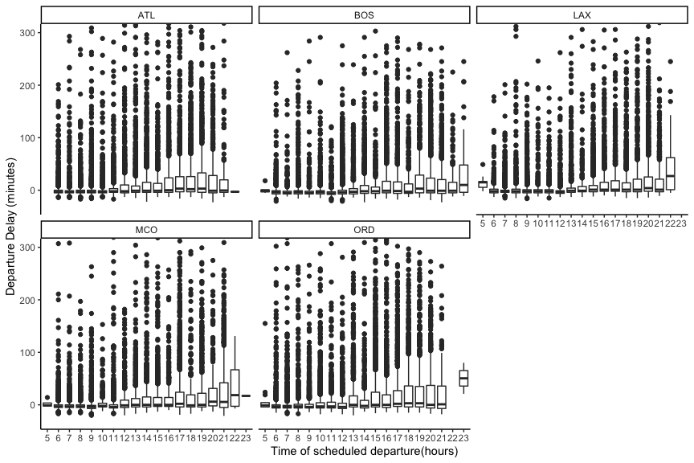<!-- -->

```r
# The patterns of each boxplot figure are similar: overall from a delay from 30 minutes ahead to 300 minutes behind, the variation of departure delay becames larger, reflected by bothe the IQR and outliers.
```

c. Continue to build on plot you created by adding a color or fill for origin airport. Describe anything interesting you observe.


```r
flights_top_five_dest %>% 
  ggplot(aes(x = factor(hour), y=dep_delay, color=origin)) + 
    geom_boxplot()+
    coord_cartesian(ylim = c(-30, 300))+
    labs(x = "Time of scheduled departure(hours)",
         y = "Departure Delay (minutes)")+
    theme_classic()+
  facet_wrap( ~ dest)
```

```
## Warning: Removed 1615 rows containing non-finite values (stat_boxplot).
```

<!-- -->

```r
# It's interesting that flights from different origins have the different variations for departure dealys. For example, Boston has the relatively smallest variation among top five destinations. 
```

d. Now is when you get to use your creativity! Using the flights data, create a plot that uses at least 4 variables. Describe why your plot is interesting and what it shows.


```r
ggplot(flights, aes(x=dep_delay,y=arr_delay, color=factor(hour)))+
  geom_point()+
  facet_wrap(~carrier)
```

```
## Warning: Removed 9430 rows containing missing values (geom_point).
```

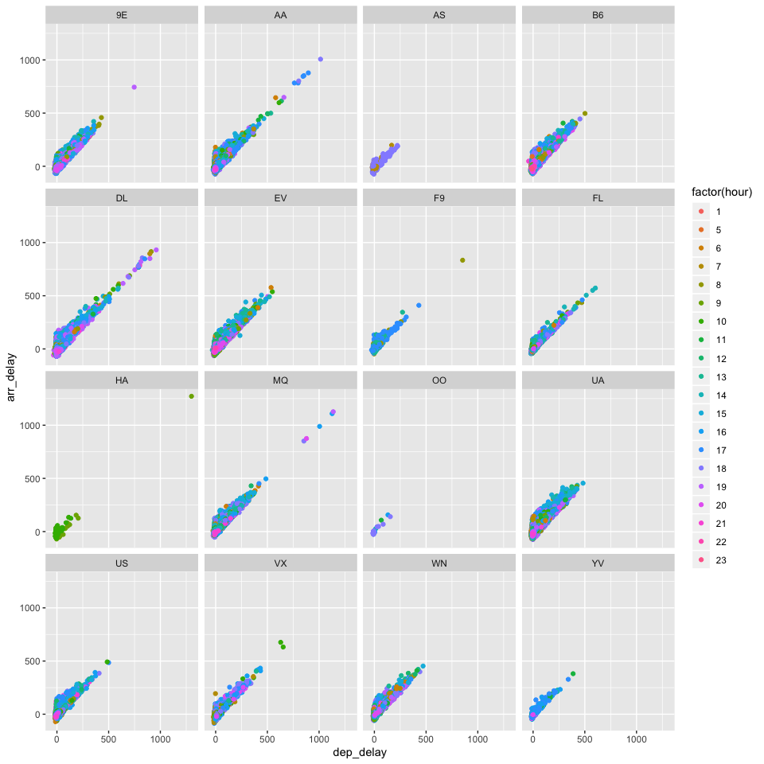<!-- -->

```r
# This figure shows the relationship between the departure, arrival delays and time of scheduled departure broken into hours among various flight carriers.
# It's interesting because this figure could show which carrier has the highest and lowest possibility of delay.
```

### Exercise 3.3 
The fracCat variable in the education data categorizes the fraction of the state’s students that take the SAT into low (below 15%), medium (15-45%), and high (at least 45%).

a. Make a univariate visualization of the fracCat variable to better understand how many states fall into each category.


```r
education <- read_csv("https://www.macalester.edu/~ajohns24/data/sat.csv")
```

```
## Parsed with column specification:
## cols(
##   State = col_character(),
##   expend = col_double(),
##   ratio = col_double(),
##   salary = col_double(),
##   frac = col_double(),
##   verbal = col_double(),
##   math = col_double(),
##   sat = col_double(),
##   fracCat = col_character()
## )
```

```r
ggplot(education, aes(x=fracCat))+
  geom_bar()
```

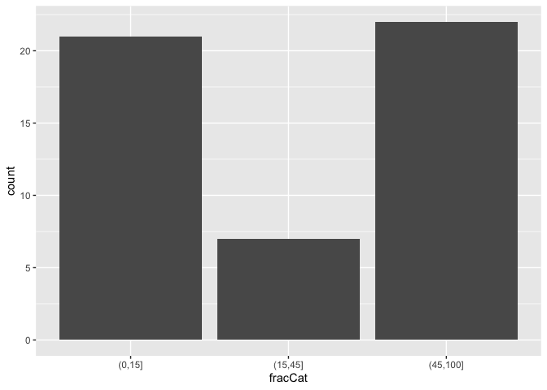<!-- -->

b. Make a bivariate visualization that demonstrates the relationship between fracCat and sat. What story does your graphic tell?


```r
ggplot(education, aes(x=fracCat, y=sat))+
  geom_point()
```

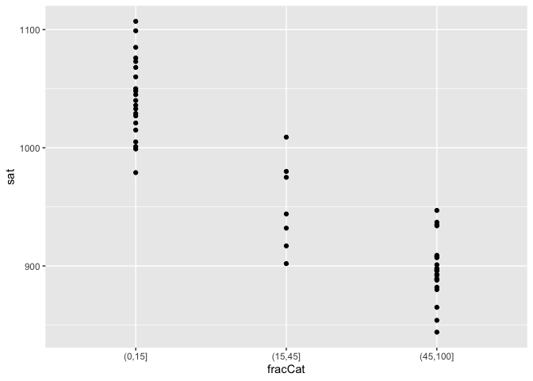<!-- -->

```r
# This graph tells that the lower percentage of all eligible students taking the SAT leads to the higher SAT average total scores in states. 
```

c. Make a trivariate visualization that demonstrates the relationship between fracCat, sat, and expend. Incorporate fracCat as the color of each point, and use a single call to geom_smooth to add three trendlines (one for each fracCat). What story does your graphic tell?


```r
ggplot(education, aes(x=expend, y=sat, color=fracCat))+
  geom_point()+
  geom_smooth(method = "lm", se = FALSE)
```

<!-- -->

```r
# This plot shows that overall the higher expenditure per pupil in average daily attendence in public elementary and secondary schools leads to a slight increase of SAT average scores in states. 
```

d. Putting all of this together, explain this example of Simpson’s Paradox (google this if you haven’t heard of it and we’ll discuss it together). That is, why does it appear that SAT scores decrease as spending increases even though the opposite is true?

```r
# In this case SAT scores decrease as spending increase but overall the increase of spending would lead to the increase of SAT scores. The reason why Simpson's Paradox appears is that the sample of the statistics is unique. Specifically, the state’s students that take the SAT into low percentage probably indicates that they prepare well for SAT because most of them are required to take the SAT. On the other hand, students that take the SAT into high percentage probably includes the students who are not required to take the SAT for SAT so that they don't need to prepare for the SAT and they just take the SAT for fun. Therefore, the average scores in state in which state’s students that take the SAT into low percentage would be higher than other states. 
```


## Activity 5: Introduction to Vizualizing Spacial Data

### Exercise 1.1 (Starbucks Locations) 

a. Add an aesthetic to the world map that sets the color of the points according to the ownership type. What, if anything, can you deduce from this visualization?


```r
Starbucks <- read_csv("https://www.macalester.edu/~ajohns24/Data/Starbucks.csv")
```

```
## Parsed with column specification:
## cols(
##   Brand = col_character(),
##   `Store Number` = col_character(),
##   `Store Name` = col_character(),
##   `Ownership Type` = col_character(),
##   `Street Address` = col_character(),
##   City = col_character(),
##   `State/Province` = col_character(),
##   Country = col_character(),
##   Postcode = col_character(),
##   `Phone Number` = col_character(),
##   Timezone = col_character(),
##   Longitude = col_double(),
##   Latitude = col_double()
## )
```

```r
world <- get_stamenmap(
    bbox = c(left = -180, bottom = -57, right = 179, top = 82.1), 
    maptype = "terrain",
    zoom = 2)
```

```
## Map tiles by Stamen Design, under CC BY 3.0. Data by OpenStreetMap, under ODbL.
```

```r
ggmap(world) +
  geom_point(data=Starbucks, 
             aes(x=Longitude,y=Latitude, color=`Ownership Type`), 
             alpha=.7, size = .5)
```

```
## Warning: Removed 1 rows containing missing values (geom_point).
```

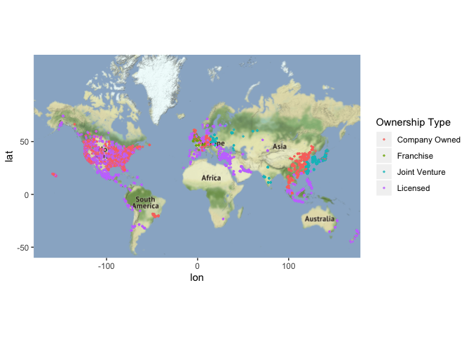<!-- -->

```r
# It can be deduced that North America has the most number of Starbucks, which are almost all company owned or licensed. And it seems that Joint Venture Starbucks is only held in Asia and Europe. 
```

b. Construct a new map of Starbucks locations in the Twin Cities metro area (approximately the 5 county metro area).


```r
TC <- get_stamenmap(
    bbox = c(left = -93.3690, bottom =44.8668 , right =-92.9124, top = 45.0718), 
    maptype = "terrain",
    zoom = 11
)
```

```
## Map tiles by Stamen Design, under CC BY 3.0. Data by OpenStreetMap, under ODbL.
```

```r
ggmap(TC) +
  geom_point(data=Starbucks, 
             aes(x=Longitude,y=Latitude, color=`Ownership Type`), 
             alpha=.7, size = 1.5) 
```

```
## Warning: Removed 25534 rows containing missing values (geom_point).
```

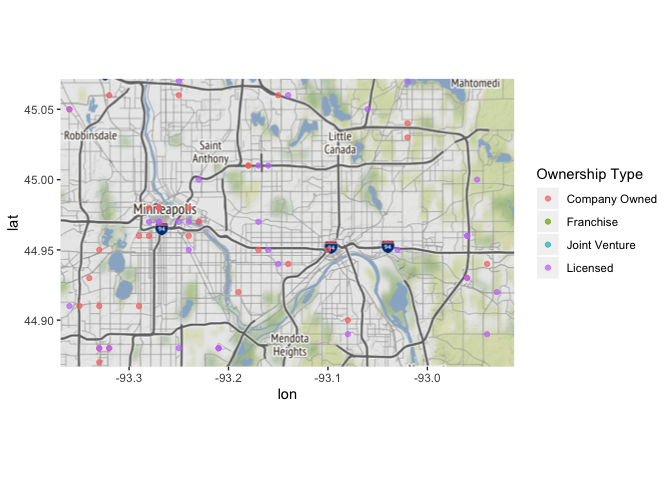<!-- -->

c. In the Twin Cities plot, play with the zoom number. What does it do? (just describe what it does - don’t actually include more than one map). 


```r
# When the zoom number increases, the map will be more detailed. 
```


d. Try a couple different map types (see get_stamenmap in help and look at maptype). Include a map with one of the other map types. 


```r
TC <- get_stamenmap(
    bbox = c(left = -93.3690, bottom =44.8668 , right =-92.9124, top = 45.0718), 
    maptype = "toner-lite",
    zoom = 11
)
```

```
## Map tiles by Stamen Design, under CC BY 3.0. Data by OpenStreetMap, under ODbL.
```

```r
ggmap(TC) +
  geom_point(data=Starbucks, 
             aes(x=Longitude,y=Latitude, color=`Ownership Type`), 
             alpha=.7, size = 1.5) 
```

```
## Warning: Removed 25534 rows containing missing values (geom_point).
```

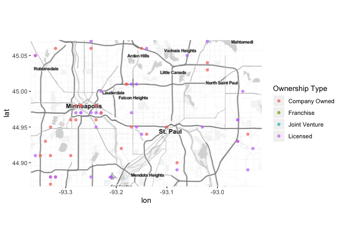<!-- -->


e. Add a point to the map that indicates Macalester College and label it appropriately. You will likely want to look at the annotate() function. 


```r
TC <- get_stamenmap(
    bbox = c(left = -93.3690, bottom =44.8668 , right =-92.9124, top = 45.0718), 
    maptype = "toner-lite",
    zoom = 11
)
```

```
## Map tiles by Stamen Design, under CC BY 3.0. Data by OpenStreetMap, under ODbL.
```

```r
ggmap(TC) +
  geom_point(data=Starbucks, 
             aes(x=Longitude,y=Latitude, color=`Ownership Type`), 
             alpha=.7, size = 1.5) +
             annotate(geom = "rect", xmax = -93.1621,xmin = -93.1765, ymax = 44.9446,ymin=44.9310, label = "Macalester College", color="red")+
             annotate(geom = "text", x=-93.1784, y=44.9335, label = "Macalester College")
```

```
## Warning: Ignoring unknown parameters: label
```

```
## Warning: Removed 25534 rows containing missing values (geom_point).
```

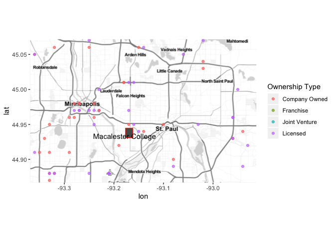<!-- -->


f. Remove the lat and lon axes from your plot - both the labels and the axes.


```r
TC <- get_stamenmap(
    bbox = c(left = -93.3690, bottom =44.8668 , right =-92.9124, top = 45.0718), 
    maptype = "toner-lite",
    zoom = 11
)
```

```
## Map tiles by Stamen Design, under CC BY 3.0. Data by OpenStreetMap, under ODbL.
```

```r
ggmap(TC) +
  geom_point(data=Starbucks, 
             aes(x=Longitude,y=Latitude, color=`Ownership Type`), 
             alpha=.7, size = 1.5) +
             annotate(geom = "point", x=-93.1721861,16, y=44.9369486, label = "Macalester College", color="red")+
             annotate(geom = "text", x=-93.1721861,16, y=44.9369486, label = "Macalester College") +
             theme_map()
```

```
## Warning: Ignoring unknown parameters: label
```

```
## Warning: Ignoring unknown aesthetics: xmin

## Warning: Ignoring unknown aesthetics: xmin
```

```
## Warning: Removed 25534 rows containing missing values (geom_point).
```

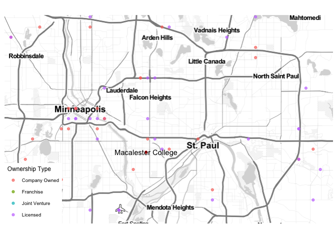<!-- -->


#### Exercise 1.2 (Nice Ride Stations) 
The dataset Stations is a list of Nice Ride stations around the Twin Cities, along with the number of docks at each station in 2016. Make a map of the stations. Use an aesthetic to distinguish the points according to the number of docks.


```r
Stations <-
  read_csv("http://www.macalester.edu/~dshuman1/data/112/Nice_Ride_2016_Station_Locations.csv")
```

```
## Warning: Missing column names filled in: 'X6' [6]
```

```
## Parsed with column specification:
## cols(
##   Terminal = col_character(),
##   Station = col_character(),
##   Latitude = col_double(),
##   Longitude = col_double(),
##   `Nb Docks` = col_double(),
##   X6 = col_character()
## )
```

```r
TC <- get_stamenmap(
    bbox = c(left = -93.3690, bottom =44.8668 , right =-92.9124, top = 45.0718), 
    maptype = "toner-lite",
    zoom = 11
)
```

```
## Map tiles by Stamen Design, under CC BY 3.0. Data by OpenStreetMap, under ODbL.
```

```r
ggmap(TC) +
  geom_point(data=Stations, aes(x=Longitude, y=Latitude, color=`Nb Docks`))
```

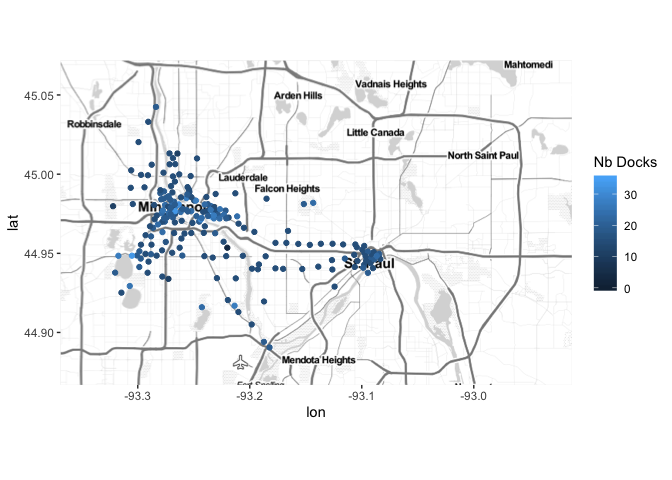<!-- -->


### Exercise 2.1 (Starbucks by State) 
The previous example did not account for population of each state in the map. In the code below, a new variable is created, starbucks_per_10000, that gives the number of Starbucks per 10,000 people. It is in the starbucks_with_2018_pop_est dataset.

a. Create a choropleth map that shows the number of Starbucks per 10,000 people on a map of the US. Adjust the figure width and height in the code chunk options, if necessary, to make the map look nicely scaled.


```r
starbucks_us_by_state <-
  Starbucks %>% 
  filter(Country == "US") %>% 
  group_by(`State/Province`) %>% 
  count() %>% 
  mutate(state_name = tolower(abbr2state(`State/Province`))) 
census_pop_est_2018 <- read_csv("https://www.dropbox.com/s/6txwv3b4ng7pepe/us_census_2018_state_pop_est.csv?dl=1") %>% 
  separate(state, into = c("dot","state"), extra = "merge") %>% 
  select(-dot) %>% 
  mutate(state = tolower(state))
```

```
## Parsed with column specification:
## cols(
##   state = col_character(),
##   est_pop_2018 = col_double()
## )
```

```r
starbucks_with_2018_pop_est <-
  starbucks_us_by_state %>% 
  left_join(census_pop_est_2018,
            by = c("state_name" = "state")) %>% 
  mutate(starbucks_per_10000 = (n/est_pop_2018)*10000)
states_map <- map_data("state")
```

```r
starbucks_with_2018_pop_est %>% 
  ggplot(aes(fill = `starbucks_per_10000`)) +
  geom_map(aes(map_id = state_name), map = states_map) +
  expand_limits(x = states_map$long, y = states_map$lat) + 
  theme_map()
```

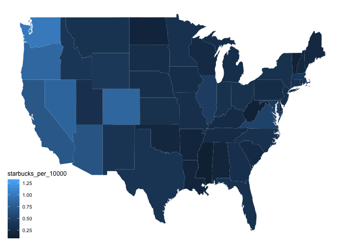<!-- -->


b. Try a new fill color and create a title for the plot. Make a conclusion about what you observe.


```r
states_map <- map_data("state")

starbucks_with_2018_pop_est %>% 
  ggplot(aes(fill = `starbucks_per_10000`)) +
  geom_map(aes(map_id = state_name), map = states_map, color="black") +
  expand_limits(x = states_map$long, y = states_map$lat) + 
  theme_map() +
  scale_fill_continuous(low="purple", high="purple4")+
  ggtitle("the number of Starbucks per 10,000 people of the US")+
  theme(plot.title = element_text(hjust = 0.5))
```

<!-- -->

```r
# Conclusion: There are more Starbucks in the west of the US than in the east of the US. 
```


