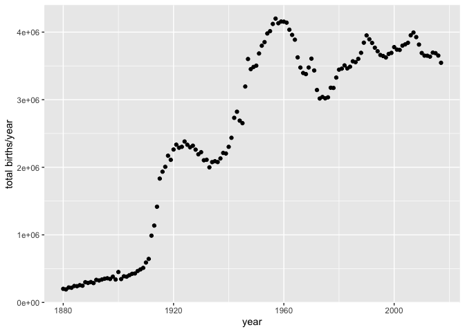
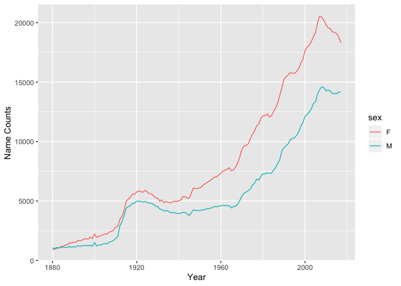
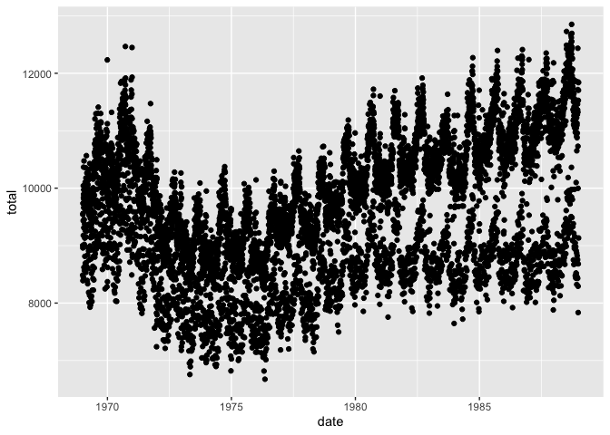
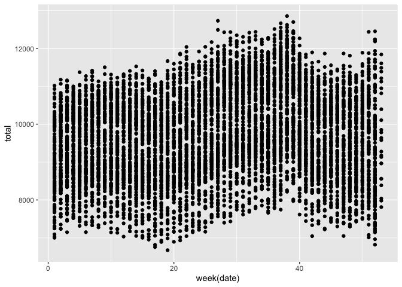
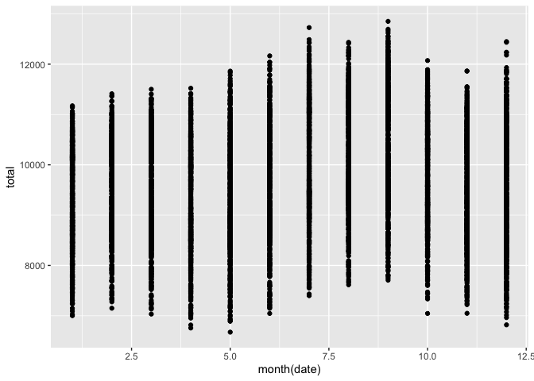
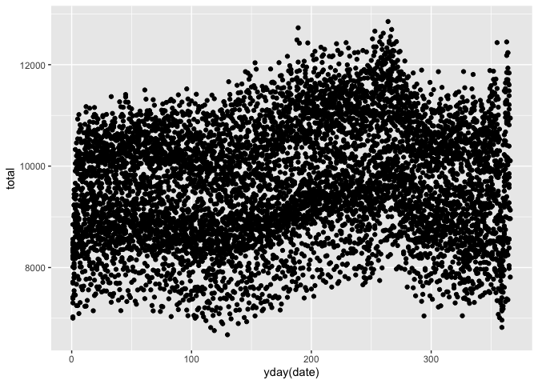
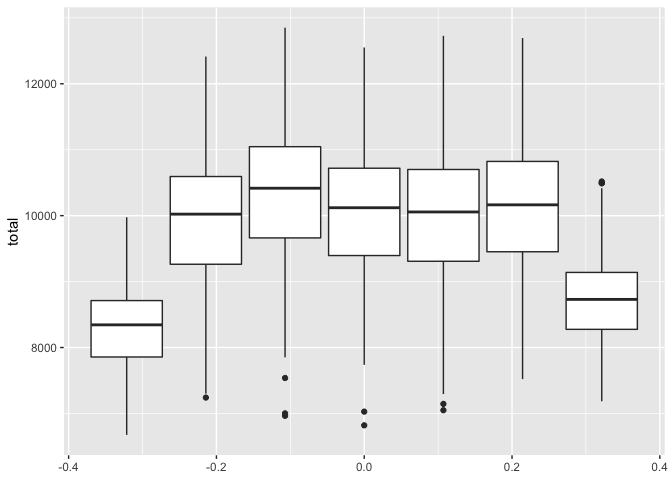
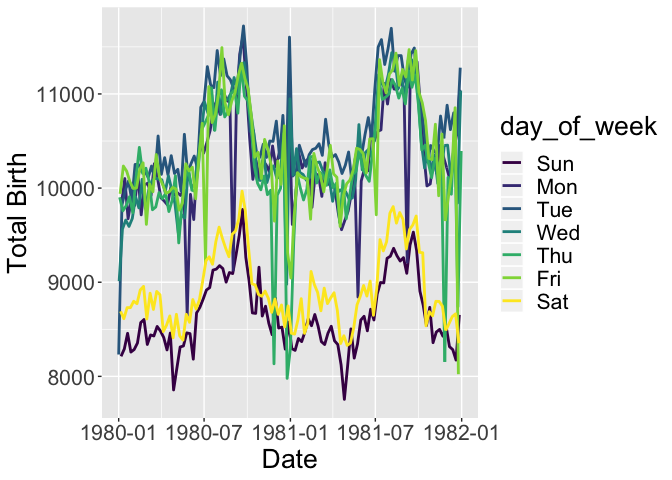
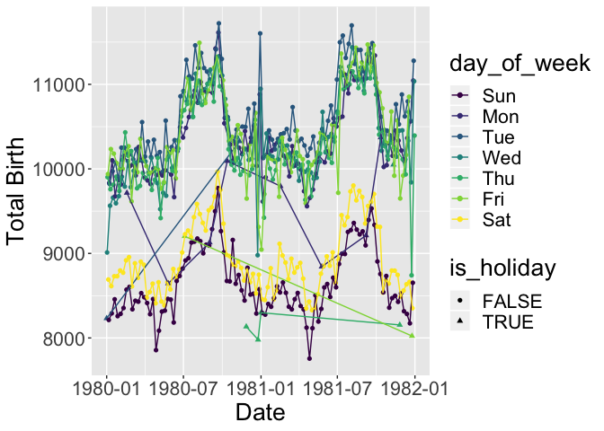
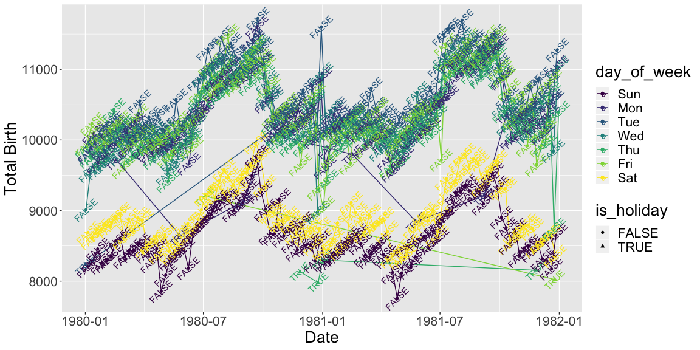

```r
library(mosaicData) 
library(babynames) 
library(lubridate) 
library(ggthemes)
library(tidyverse)
```

*Exercise 3.1*

a. Add a new boolean (true or false) variable called has2000 that indicates whether there were more than 2000 babies of that sex with that name in each year. Display the first six rows of your new table.


```r
babynames %>%
  mutate(has2000=(n>2000)) %>%
  head()
```

```
## # A tibble: 6 x 6
##    year sex   name          n   prop has2000
##   <dbl> <chr> <chr>     <int>  <dbl> <lgl>  
## 1  1880 F     Mary       7065 0.0724 TRUE   
## 2  1880 F     Anna       2604 0.0267 TRUE   
## 3  1880 F     Emma       2003 0.0205 TRUE   
## 4  1880 F     Elizabeth  1939 0.0199 FALSE  
## 5  1880 F     Minnie     1746 0.0179 FALSE  
## 6  1880 F     Margaret   1578 0.0162 FALSE
```

b. Compute the proportion of names each year that had more than 2000 babies. TIP: you can use TRUEs and FALSEs mathematically. TRUE = 1 and FALSE = 0.


```r
babynames %>%
  mutate(has2000=(n>2000)) %>%
  group_by(year) %>%
  summarize(has200 = sum(has2000)/n())
```

```
## # A tibble: 138 x 2
##     year  has200
##    <dbl>   <dbl>
##  1  1880 0.0075 
##  2  1881 0.00775
##  3  1882 0.00799
##  4  1883 0.00816
##  5  1884 0.00784
##  6  1885 0.00785
##  7  1886 0.00836
##  8  1887 0.00801
##  9  1888 0.0106 
## 10  1889 0.0104 
## # … with 128 more rows
```

*Exercise 3.2*

a. Find the number of total babies per year. Save this as a new dataset.


```r
bbperyr <- babynames %>%
  group_by(year) %>%
  summarize(total=sum(n))

bbperyr
```

```
## # A tibble: 138 x 2
##     year  total
##    <dbl>  <int>
##  1  1880 201484
##  2  1881 192696
##  3  1882 221533
##  4  1883 216946
##  5  1884 243462
##  6  1885 240854
##  7  1886 255317
##  8  1887 247394
##  9  1888 299473
## 10  1889 288946
## # … with 128 more rows
```

b.Sort the dataset above from most babies to least babies. Which year were the most babies born? Least?


```r
bbperyr <- babynames %>%
  group_by(year) %>%
  summarize(total=sum(n)) 

bbperyr %>%
  arrange(desc(total))
```

```
## # A tibble: 138 x 2
##     year   total
##    <dbl>   <int>
##  1  1957 4200007
##  2  1959 4156434
##  3  1960 4154377
##  4  1961 4140244
##  5  1958 4131657
##  6  1956 4121070
##  7  1962 4035234
##  8  1955 4014041
##  9  2007 3994007
## 10  1954 3979884
## # … with 128 more rows
```

```r
bbperyr %>%
  arrange(total)
```

```
## # A tibble: 138 x 2
##     year  total
##    <dbl>  <int>
##  1  1881 192696
##  2  1880 201484
##  3  1883 216946
##  4  1882 221533
##  5  1885 240854
##  6  1884 243462
##  7  1887 247394
##  8  1886 255317
##  9  1891 286672
## 10  1889 288946
## # … with 128 more rows
```

```r
# 1957 is the year that most babies were born and 1881 is the year that least babies were bron.
```

c. Use the dataset from the first part to graph the number of babies born over time. Include a nice label for the x and y axes. Describe what you see.


```r
bbperyr %>%
  ggplot(aes(x=year, y=total))+
  geom_point()+
  labs(y="total births/year")
```

<!-- -->

"""Overall the total birth per year is increasing before 1980 and becomes relatively steady, but there are significant decreases in 1930 and 1970

*Exercise 3.3*

a. Find the most popular names for males, over all years and ordered by popularity.


```r
babynames %>%
  group_by(sex, name) %>%
  filter(sex=="M") %>%
  summarize(total=sum(n)) %>%
  arrange(desc(total))
```

```
## # A tibble: 40,927 x 3
## # Groups:   sex [1]
##    sex   name      total
##    <chr> <chr>     <int>
##  1 M     James   5150472
##  2 M     John    5115466
##  3 M     Robert  4814815
##  4 M     Michael 4350824
##  5 M     William 4102604
##  6 M     David   3611329
##  7 M     Joseph  2603445
##  8 M     Richard 2563082
##  9 M     Charles 2386048
## 10 M     Thomas  2304948
## # … with 40,917 more rows
```

```r
# James is the most popular males name. 
```

b. Find the most popular names for females, over all years and ordered by popularity.


```r
babynames %>%
  group_by(sex, name) %>%
  filter(sex=="F") %>%
  summarize(total=sum(n)) %>%
  arrange(desc(total))
```

```
## # A tibble: 67,046 x 3
## # Groups:   sex [1]
##    sex   name        total
##    <chr> <chr>       <int>
##  1 F     Mary      4123200
##  2 F     Elizabeth 1629679
##  3 F     Patricia  1571692
##  4 F     Jennifer  1466281
##  5 F     Linda     1452249
##  6 F     Barbara   1434060
##  7 F     Margaret  1246649
##  8 F     Susan     1121440
##  9 F     Dorothy   1107096
## 10 F     Sarah     1073895
## # … with 67,036 more rows
```

```r
# Mary is the most females name. 
```

*Exercise 3.4*

a. Plot the number of distinct/unique names by year and sex (ie. a different line for males and females). Include nice x and y labels.


```r
babynames %>% 
  group_by(year, sex) %>% 
  summarise(c=n()) %>% 
  ggplot(aes(x=year, y=c, color=sex)) +
  geom_line() +
  labs(x="Year", y="Name Counts")
```

<!-- -->

b. Find the top five names for males and females for each year. Tip: Use top_n or head along with group_by.


```r
babynames %>%
  group_by(year,sex) %>%
  top_n(5,n) 
```

```
## # A tibble: 1,380 x 5
## # Groups:   year, sex [276]
##     year sex   name          n   prop
##    <dbl> <chr> <chr>     <int>  <dbl>
##  1  1880 F     Mary       7065 0.0724
##  2  1880 F     Anna       2604 0.0267
##  3  1880 F     Emma       2003 0.0205
##  4  1880 F     Elizabeth  1939 0.0199
##  5  1880 F     Minnie     1746 0.0179
##  6  1880 M     John       9655 0.0815
##  7  1880 M     William    9532 0.0805
##  8  1880 M     James      5927 0.0501
##  9  1880 M     Charles    5348 0.0452
## 10  1880 M     George     5126 0.0433
## # … with 1,370 more rows
```

c. Start with the code from the previous problem. Find the proportion of names that are in the top 5 for each sex and year and plot it by year.


```r
babynames %>% 
  group_by(year, sex) %>% 
  top_n(5,n) %>% 
  summarise(top_five_p = sum(prop))
```

```
## # A tibble: 276 x 3
## # Groups:   year [138]
##     year sex   top_five_p
##    <dbl> <chr>      <dbl>
##  1  1880 F          0.157
##  2  1880 M          0.301
##  3  1881 F          0.153
##  4  1881 M          0.296
##  5  1882 F          0.154
##  6  1882 M          0.287
##  7  1883 F          0.150
##  8  1883 M          0.285
##  9  1884 F          0.149
## 10  1884 M          0.275
## # … with 266 more rows
```

*Exercise 3.5*

Compute the decade for each observation using the code below. Then, summarize the names by decade. Find the counts and proportion of each of the baby names by decade and sex. For the proportion, just find the proportion based on the total number of names in the data we have in this dataset. Save this to a new dataset called names_by_decade. Print the first 6 rows of the dataset.


```r
names_by_decade <- babynames %>% 
  mutate(decade = floor(year/10)*10) %>%
  group_by(decade, sex, name) %>%
  summarise(n=sum(n)) %>% 
  ungroup() %>% 
  group_by(decade, sex) %>% 
  mutate(p = n/sum(n)) %>%
  ungroup()

names_by_decade %>% 
  head()
```

```
## # A tibble: 6 x 5
##   decade sex   name        n          p
##    <dbl> <chr> <chr>   <int>      <dbl>
## 1   1880 F     Abbie     929 0.000708  
## 2   1880 F     Abby       64 0.0000488 
## 3   1880 F     Abigail   133 0.000101  
## 4   1880 F     Ada      8423 0.00642   
## 5   1880 F     Adah      330 0.000251  
## 6   1880 F     Adalene     5 0.00000381
```

Exercise 3.6

Use the names_by_decade dataset you created in the previous exercise to find the most popular name each decade. Create a table that shows the sex, decade, the most popular name, and the proportion of babies in the decade with that name. Also create a plot, but plot the text of the most popular name, rather than just points (hint: geom_text()).


```r
popularname <- names_by_decade %>% 
  group_by(decade, sex) %>% 
  top_n(1, wt=p) %>% 
  select(decade, sex, name, p)

popularname
```

```
## # A tibble: 28 x 4
## # Groups:   decade, sex [28]
##    decade sex   name        p
##     <dbl> <chr> <chr>   <dbl>
##  1   1880 F     Mary   0.0698
##  2   1880 M     John   0.0821
##  3   1890 F     Mary   0.0590
##  4   1890 M     John   0.0707
##  5   1900 F     Mary   0.0552
##  6   1900 M     John   0.0623
##  7   1910 F     Mary   0.0587
##  8   1910 M     John   0.0564
##  9   1920 F     Mary   0.0587
## 10   1920 M     Robert 0.0523
## # … with 18 more rows
```

```r
popularname%>% 
  ggplot(aes(x=decade, y=p, label=name))+
  geom_text()
```

<!-- -->

## 4 Exercises Part 2: US Births

*Exercise 4.1 (Total Across States) *

Create a new data table, DailyBirths, that adds up all the births for each day across all the states. Plot daily births vs date.


```r
DailyBirths <-
  Birthdays %>%
  group_by(date) %>%
  summarize(total = sum(births))
DailyBirths
```

```
## # A tibble: 7,305 x 2
##    date                total
##    <dttm>              <int>
##  1 1969-01-01 00:00:00  8486
##  2 1969-01-02 00:00:00  9002
##  3 1969-01-03 00:00:00  9542
##  4 1969-01-04 00:00:00  8960
##  5 1969-01-05 00:00:00  8390
##  6 1969-01-06 00:00:00  9560
##  7 1969-01-07 00:00:00  9738
##  8 1969-01-08 00:00:00  9734
##  9 1969-01-09 00:00:00  9434
## 10 1969-01-10 00:00:00 10042
## # … with 7,295 more rows
```

```r
DailyBirths %>% 
  ggplot(aes(x=date, y=total)) +
  geom_point()
```

<!-- -->

*Exercise 4.2 (Examine Seasonality)*
To examine seasonality in birth rates, look at the number of births aggregated over all the years by
a. each week

```r
ggplot(DailyBirths, aes(x=week(date), y=total)) +
  geom_point()
```

<!-- -->

b. each month

```r
ggplot(DailyBirths, aes(x=month(date), y=total)) +
  geom_point()
```

<!-- -->

c. each Julian day

```r
ggplot(DailyBirths, aes(x=yday(date), y=total)) +
  geom_point()
```

<!-- -->

When are the most babies born? The fewest?

"""Summer is the time most babies born and winter is the time the fewest babies born"""

*Exercise 4.3 (Examine Patterns within the Week)*

To examine patterns within the week, make a side by side box plots showing the number of births by day of the week. Interpret your results.


```r
ggplot(DailyBirths, aes(group=wday(date), y=total)) +
  geom_boxplot()
```

<!-- -->

"""There would be more people born in the weekday than in the weekend."""

*Exercise 4.4 (Two Year Sample)*

Create a new dataset that filters the DailyBirths dataset you made above to a two-year span that falls in the 1980s, say 1980-1981 (Hint: use the year() function to extract years). Add a variable to the dataset that is a ymd (from lubridate package) version of the date and a variable for day of the week. Call your new dataset MyTwoYears. Then create a plot that shows the number of births over time with a different color line for each day of the week. Make sure to choose your font size, line widths, and color scheme to make your figure legible. Create nice labels as well. Explain the pattern that you see.

The plot you generate for Exercise 4.4 should be generally consistent with the weekend effect and seasonal patterns we have already seen; however, a few days each year stand out as exceptions. We are going to examine the hypothesis that these are holidays. You can find a data set listing US federal holidays at http://www.macalester.edu/~dshuman1/data/112/US-Holidays.csv. Read it in as follows:

```r
Holidays <- read_csv("http://www.macalester.edu/~dshuman1/data/112/US-Holidays.csv") %>%
  mutate(date = dmy(date))
```

```
## Parsed with column specification:
## cols(
##   holiday = col_character(),
##   date = col_character(),
##   year = col_double()
## )
```


```r
MyTwoYears <-
  DailyBirths %>% 
  filter(year(date) %in% 1980:1981) %>% 
  mutate(date2=ymd(date), day_of_week = wday(date, label=TRUE))

MyTwoYears %>% 
  ggplot(aes(x=date2, y=total, color=day_of_week))+
  geom_line(size=1)+
  theme(text = element_text(size=20))+
  labs(x="Date", y="Total Birth")
```

<!-- -->

"""It follows the pattern that most babies born in the summer and least in the winter, and born more in weekday than weekend."""

*Exercise 4.5 (Holidays)*

Now we will update the plot from Exercise 4.4 to include the holidays.

a. Create a new dataset called my_two_new where you add a variable to MyTwoYears called is_holiday. The new variable should be TRUE when the day is a holiday, and FALSE otherwise. One way to do this is with the transformation verb %in%, for instance, is_holiday = date %in% Holidays$date.


```r
my_two_new <- MyTwoYears %>% 
  mutate(is_holiday=date2 %in% Holidays$date)

my_two_new
```

```
## # A tibble: 731 x 5
##    date                total date2      day_of_week is_holiday
##    <dttm>              <int> <date>     <ord>       <lgl>     
##  1 1980-01-01 00:00:00  8232 1980-01-01 Tue         TRUE      
##  2 1980-01-02 00:00:00  9011 1980-01-02 Wed         FALSE     
##  3 1980-01-03 00:00:00  9902 1980-01-03 Thu         FALSE     
##  4 1980-01-04 00:00:00  9939 1980-01-04 Fri         FALSE     
##  5 1980-01-05 00:00:00  8691 1980-01-05 Sat         FALSE     
##  6 1980-01-06 00:00:00  8213 1980-01-06 Sun         FALSE     
##  7 1980-01-07 00:00:00  9833 1980-01-07 Mon         FALSE     
##  8 1980-01-08 00:00:00  9822 1980-01-08 Tue         FALSE     
##  9 1980-01-09 00:00:00  9564 1980-01-09 Wed         FALSE     
## 10 1980-01-10 00:00:00  9759 1980-01-10 Thu         FALSE     
## # … with 721 more rows
```

b. Add a geom_point layer to your plot that sets the color of the points based on the day of the week and the shape of the points based on whether or not the day is a holiday.


```r
my_two_new %>% 
  ggplot(aes(x=date2, y=total, color=day_of_week, shape=is_holiday)) + 
  layer(geom="point",stat = "identity", position = "identity")+
  theme(text = element_text(size=20)) +
  labs(x="Date", y="Total Birth") +
  geom_line()
```

<!-- -->

c. (EXTRA CREDIT) Finally, some holidays seem to have more of an effect than others. It would be helpful to label them. Use geom_text or annotate to add labels to the holidays that seem to have an effect. Hints: You may have to make up a y-coordinate for each label. You can set the orientation of each label with the angle argument.


```r
my_two_new %>% 
  ggplot(aes(x=date2, y=total, color=day_of_week, shape=is_holiday, label=is_holiday)) + 
  layer(geom="point",stat = "identity", position = "identity")+
  theme(text = element_text(size=20)) +
  labs(x="Date", y="Total Birth") +
  geom_line()+
  geom_text(angle=45)
```

<!-- -->


