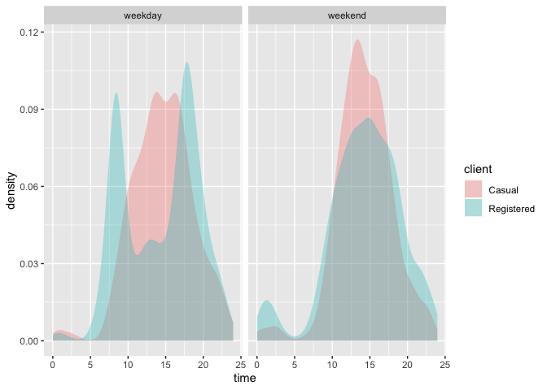

```r
library(tidyverse)
library(lubridate)
library(ggmap)
```
## Activity 08 - Joins

*Exercise 1.1*
Use your wrangling skills to answer the following questions. Hint 1: start by thinking about what tables you might need to join (if any) and identifying the corresponding variables to match. Hint 2: you will need an extra table to convert grades to grade point averages. I have given you the code below.

a. How many student enrollments in each department?

```r
Grades <- read_csv("http://www.macalester.edu/~dshuman1/data/112/grades.csv") %>%
  distinct(sid,sessionID,.keep_all = TRUE) 
Courses <- read_csv("http://www.macalester.edu/~dshuman1/data/112/courses.csv")

Courses %>% 
  group_by(dept) %>% 
  summarize(sum(enroll))
```

```
## # A tibble: 40 x 2
##    dept  `sum(enroll)`
##    <chr>         <dbl>
##  1 A                29
##  2 b               385
##  3 B               104
##  4 C              1336
##  5 d              3046
##  6 D              2003
##  7 e               675
##  8 E               119
##  9 F              1587
## 10 g                82
## # … with 30 more rows
```

b. What is the grade-point average (GPA) for each student? The average student GPA? Hint: There are some “S” and “AU” grades that we want to exclude from GPA calculations. What is the correct variant of join to accomplish this?

```r
GPAConversion <- tibble(grade=c("A+","A","A-","B+","B","B-","C+","C","C-","D+","D","D-","NC"),
                        gpa=c(4.3,4,3.7,3.3,3,2.7,2.3,2,1.7,1.3,1,0.7,0))

Grades %>% 
  left_join(GPAConversion, by="grade") %>% 
  filter(grade!="S", grade!="AU") %>%
  group_by(sid) %>% 
  summarize(sum(gpa)/n())
```

```
## # A tibble: 443 x 2
##    sid    `sum(gpa)/n()`
##    <chr>           <dbl>
##  1 S31185           2.41
##  2 S31188           3.02
##  3 S31191           3.21
##  4 S31194           3.36
##  5 S31197           3.35
##  6 S31200           2.2 
##  7 S31203           3.82
##  8 S31206           2.46
##  9 S31209           3.13
## 10 S31212           3.67
## # … with 433 more rows
```


c. What fraction of grades are below B+?

```r
Grades %>% 
  inner_join(GPAConversion, by="grade") %>% 
  mutate(gpabb=gpa<3.3) %>% 
  summarize(avgpa=mean(gpabb))
```

```
## # A tibble: 1 x 1
##   avgpa
##   <dbl>
## 1 0.283
```

> The fraction of grades that are below B+ is 0.2834776

d. What is the grade-point average for each instructor?


```r
Grades %>% 
  inner_join(GPAConversion, by="grade") %>% 
  inner_join(Courses, by="sessionID") %>% 
  group_by(iid) %>% 
  summarise(gpa_iid=sum(gpa)/n()) %>% 
  filter(gpa_iid!="NA")
```

```
## # A tibble: 359 x 2
##    iid     gpa_iid
##    <chr>     <dbl>
##  1 inst125    3.42
##  2 inst126    3.51
##  3 inst128    3.16
##  4 inst129    3.57
##  5 inst130    3.7 
##  6 inst132    3.75
##  7 inst133    3.6 
##  8 inst134    3.61
##  9 inst135    2.97
## 10 inst136    3.49
## # … with 349 more rows
```

e. We cannot actually compute the correct grade-point average for each department from the information we have. The reason why is due to cross-listed courses. Students for those courses could be enrolled under either department, and we do not know which department to asign the grade to. There are a number of possible workarounds to get an estimate. One would be to assign all grades in a section to the department of the instructor, which we would have to infer from the data. Instead, start by creating a table with all cross-listed courses. Then use an anti_join to eliminate all cross-listed courses. Finally, use an inner_join to compute the grade-point average for each department.


```r
clc<-Courses %>% 
  count(sessionID) %>% 
  filter(n>1) 

Grades %>% 
  inner_join(Courses, by="sessionID") %>%
  anti_join(clc, by="sessionID") %>% 
  inner_join(GPAConversion, by="grade") %>% 
  group_by(dept) %>% 
  summarize(gpa=mean(gpa))
```

```
## # A tibble: 38 x 2
##    dept    gpa
##    <chr> <dbl>
##  1 A      3.5 
##  2 b      3.25
##  3 B      3.2 
##  4 C      3.53
##  5 d      3.31
##  6 D      3.59
##  7 e      3.49
##  8 E      3.64
##  9 F      3.30
## 10 G      3.18
## # … with 28 more rows
```


*Exercise 2.1 (Warm-up: temporal patterns)*
Make the following plots and interpret them:

a. A density plot of the events versus sdate. Use ggplot() and geom_density().


```r
data_site <- 
  "https://www.macalester.edu/~dshuman1/data/112/2014-Q4-Trips-History-Data-Small.rds" 
Trips <- readRDS(gzcon(url(data_site)))
Stations<-read_csv("http://www.macalester.edu/~dshuman1/data/112/DC-Stations.csv")
```

```
## Parsed with column specification:
## cols(
##   name = col_character(),
##   lat = col_double(),
##   long = col_double(),
##   nbBikes = col_double(),
##   nbEmptyDocks = col_double()
## )
```

```r
Trips %>% 
  ggplot(aes(x=sdate)) +
  geom_density()
```

<!-- -->

b. A density plot of the events versus time of day. You can use mutate with lubridates hour()andminute()functions to extract the hour of the day and minute within the hour fromsdate`. Hint: A minute is 1/60 of an hour, so create a variable where 3:30 is 3.5 and 3:45 is 3.75.


```r
Trips %>% 
  mutate(hr=hour(sdate), min=minute(sdate), time=hr+min/60) %>% 
  ggplot(aes(x=time))+
  geom_density()
```

<!-- -->
c. A bar graph of the events versus day of the week. Use coord_flip to flip the coordinates so day is on the y-axis.


```r
Trips %>% 
  mutate(day=wday(sdate)) %>% 
  ggplot(aes(x=day))+
  geom_bar()+
  coord_flip()
```

<!-- -->

d. Facet your graph from (b) by day of the week. Is there a pattern?
The variable client describes whether the renter is a regular user (level Registered) or has not joined the bike-rental organization (Causal). Do you think these two different categories of users show different rental behavior? How might it interact with the patterns you found in Exercise 2.1?


```r
Trips %>% 
  mutate(hr=hour(sdate), min=minute(sdate), day=wday(sdate), time=hr+min/60, ) %>% 
  ggplot(aes(x=time))+
  geom_density() +
  facet_wrap(vars(day))
```

<!-- -->
> Yes, there is a pattern on the weekdays, which has higher densities in the morning and the afternoon while lower at noon and night, and there is a pattern on the weekends, whcih increases the density from the moring and decreases from the afternoon. 

> Yes I think these two different categories of users show different rental behavior. I think for renters, they may has more demand for bikes at noon than regular clients. 

*Exercise 2.2 (Customer segmentation)* Repeat the graphic from Exercise 2.1 (d) with the following changes:

a. Set the fill aesthetic for geom_density() to the client variable. You may also want to set the alpha for transparency and color=NA to suppress the outline of the density function.


```r
Trips %>% 
  mutate(day=wday(sdate, label=TRUE), time=hour(sdate)+minute(sdate)/60) %>% 
  ggplot(aes(x=time, fill=client))+
  geom_density(alpha=0.3, color=NA) +
  facet_wrap(vars(day))
```

<!-- -->

b. Now add the argument position = position_stack() to geom_density(). In your opinion, is this better or worse in terms of telling a story? What are the advantages/disadvantages of each?

```r
Trips %>% 
  mutate(time=hour(sdate)+minute(sdate)/60,day=wday(sdate, label=TRUE)) %>% 
  ggplot(aes(x=time, fill=client))+
  geom_density(alpha=0.3, color=NA, position = position_stack()) +
  facet_wrap(vars(day))
```

<!-- -->
> I think this figure is better. Advantage: people can know the overall patterns between both casual and registered clients and the density.  Disadvantage: this figure can't tell the difference of patterns between the casual and registered clients. 

c. Rather than faceting on day of the week, create a new faceting variable like this: mutate(wday = ifelse(wday(sdate) %in% c(1,7), "weekend", "weekday")). What does the variable wday represent? Try to understand the code.


```r
Trips %>% 
  mutate(time=hour(sdate)+minute(sdate)/60,
         day=wday(sdate, label=TRUE)) %>% 
  mutate(wday = ifelse(wday(sdate) %in% c(1,7), "weekend", "weekday")) %>% 
  ggplot(aes(x=time))+
  geom_density(alpha=0.3, color=NA,aes(fill=client)) +
  facet_wrap(vars(wday))
```

<!-- -->
> wady represents whether it's a weekday or weekend.


d. Is it better to facet on wday and fill with client, or vice versa?

```r
Trips %>% 
  mutate(time=hour(sdate)+minute(sdate)/60,
         day=wday(sdate, label=TRUE)) %>% 
  mutate(wday = ifelse(wday(sdate) %in% c(1,7), "weekend", "weekday")) %>% 
  ggplot(aes(x=time))+
  geom_density(alpha=0.3, color=NA, aes(fill=wday)) +
  facet_wrap(vars(client))
```

<!-- -->

> It's better to facet on wady and fill with client because finding the differences or similarities of Casual and registered clients makes more sense in this case, and this figure show the patterns of the use time of two kinds of clients on the weekday and weekend. 

e. Of all of the graphics you created so far, which is most effective at telling an interesting story?

> The graph from b is most effective at telling an interesting story because it shows the how casual cliends demand more bikes than registered clients, and it also shows the different pattern between the weekdays and weekends.


*Exercise 2.3 (Visualization of bicycle departures by station)* Use the latitude and longitude variables in Stations to make a visualization of the total number of departures from each station in the Trips data.


```r
DC <- get_stamenmap(
    bbox = c(left = -77.4665, bottom = 38.7034, right =-76.5533, top = 39.1543), 
    maptype = "terrain",
    zoom = 11
)
```

```
## Map tiles by Stamen Design, under CC BY 3.0. Data by OpenStreetMap, under ODbL.
```

```r
ST<-
  Trips %>% 
  left_join(Stations, by=c("sstation"="name")) %>% 
  group_by(sstation) %>% 
  mutate(n=n())
  
ggmap(DC) +
  geom_point(data=ST, 
             aes(x=long,y=lat, color=n), 
             alpha=1) 
```

```
## Warning: Removed 183 rows containing missing values (geom_point).
```

<!-- -->

*Exercise 2.4* Only 14.4% of the trips in our data are carried out by casual users. Create a map that shows which area(s) of the city have stations with a much higher percentage of departures by casual users. Interpret your map.


```r
casual <- ST %>% 
  group_by(long, lat) %>% 
  summarise(prop=sum(client=="Casual")/n())

ggmap(DC) +
  geom_point(data=casual, 
             aes(x=long,y=lat, color=prop), 
             alpha=1) 
```

```
## Warning: Removed 1 rows containing missing values (geom_point).
```

<!-- -->
> Casual users are everywhere, both in the city and the suburban, for commuters and travellers, but overall there are more use in the center of DC, probably because most of clients are registered clients who commute everyday. 

*Exercise 2.5 (High traffic points)*

a. Make a table with the ten station-date combinations (e.g., 14th & V St., 2014-10-14) with the highest number of departures, sorted from most departures to fewest. Hint: as_date(sdate) converts sdate from date-time format to date format.


```r
Topten <-
Trips %>% 
  mutate(Date=as_date(sdate)) %>% 
  group_by(sstation, Date) %>% 
  summarize(Total_Trips=n()) %>% 
  arrange(desc(Total_Trips)) %>% 
  head(10)

Topten
```

```
## # A tibble: 10 x 3
## # Groups:   sstation [8]
##    sstation                             Date       Total_Trips
##    <chr>                                <date>           <int>
##  1 Columbus Circle / Union Station      2014-11-12          11
##  2 Jefferson Dr & 14th St SW            2014-12-27           9
##  3 Lincoln Memorial                     2014-10-05           9
##  4 Lincoln Memorial                     2014-10-09           8
##  5 17th St & Massachusetts Ave NW       2014-10-06           7
##  6 Columbus Circle / Union Station      2014-10-02           7
##  7 Georgetown Harbor / 30th St NW       2014-10-25           7
##  8 Massachusetts Ave & Dupont Circle NW 2014-10-01           7
##  9 New Hampshire Ave & T St NW          2014-10-16           7
## 10 14th & V St NW                       2014-11-07           6
```

b. Use a join operation to make a table with only those trips whose departures match those top ten station-date combinations from part (a).


```r
Trip2 <-
Trips %>% 
  mutate(Date=as_date(sdate)) %>% 
  semi_join(Topten, by=c("sstation", "Date"))
Trip2
```

```
##      duration               sdate                             sstation
## 1  0h 12m 43s 2014-10-02 08:23:00      Columbus Circle / Union Station
## 2   0h 7m 57s 2014-10-09 11:34:00                     Lincoln Memorial
## 3  2h 10m 20s 2014-10-05 12:35:00                     Lincoln Memorial
## 4   0h 30m 6s 2014-10-05 11:58:00                     Lincoln Memorial
## 5   0h 7m 41s 2014-10-01 22:01:00 Massachusetts Ave & Dupont Circle NW
## 6  0h 20m 32s 2014-10-16 07:04:00          New Hampshire Ave & T St NW
## 7   0h 13m 0s 2014-11-12 06:08:00      Columbus Circle / Union Station
## 8  0h 23m 24s 2014-10-02 09:19:00      Columbus Circle / Union Station
## 9  0h 13m 36s 2014-12-27 13:43:00            Jefferson Dr & 14th St SW
## 10  0h 3m 41s 2014-10-06 12:45:00       17th St & Massachusetts Ave NW
## 11 0h 11m 15s 2014-10-16 09:05:00          New Hampshire Ave & T St NW
## 12 0h 13m 38s 2014-10-09 22:07:00                     Lincoln Memorial
## 13 0h 24m 26s 2014-10-25 18:01:00       Georgetown Harbor / 30th St NW
## 14 0h 17m 49s 2014-10-25 16:18:00       Georgetown Harbor / 30th St NW
## 15   0h 8m 8s 2014-10-02 06:07:00      Columbus Circle / Union Station
## 16  0h 6m 31s 2014-10-01 08:49:00 Massachusetts Ave & Dupont Circle NW
## 17  0h 17m 0s 2014-10-25 16:19:00       Georgetown Harbor / 30th St NW
## 18 0h 17m 45s 2014-10-09 13:43:00                     Lincoln Memorial
## 19  0h 11m 5s 2014-10-06 21:33:00       17th St & Massachusetts Ave NW
## 20  0h 57m 4s 2014-12-27 09:47:00            Jefferson Dr & 14th St SW
## 21  0h 9m 23s 2014-11-07 19:54:00                       14th & V St NW
## 22  0h 20m 5s 2014-10-05 18:30:00                     Lincoln Memorial
## 23 0h 53m 48s 2014-12-27 09:50:00            Jefferson Dr & 14th St SW
## 24 0h 19m 21s 2014-12-27 11:16:00            Jefferson Dr & 14th St SW
## 25 0h 12m 26s 2014-10-06 19:13:00       17th St & Massachusetts Ave NW
## 26 0h 28m 33s 2014-10-25 17:16:00       Georgetown Harbor / 30th St NW
## 27 0h 20m 47s 2014-10-01 22:46:00 Massachusetts Ave & Dupont Circle NW
## 28  0h 14m 5s 2014-12-27 15:52:00            Jefferson Dr & 14th St SW
## 29  0h 8m 52s 2014-11-07 17:41:00                       14th & V St NW
## 30 0h 11m 48s 2014-11-12 07:42:00      Columbus Circle / Union Station
## 31 0h 36m 38s 2014-10-05 11:11:00                     Lincoln Memorial
## 32 0h 16m 10s 2014-10-06 08:47:00       17th St & Massachusetts Ave NW
## 33 0h 38m 22s 2014-12-27 15:50:00            Jefferson Dr & 14th St SW
## 34  0h 8m 44s 2014-10-16 08:19:00          New Hampshire Ave & T St NW
## 35 0h 25m 15s 2014-10-25 13:42:00       Georgetown Harbor / 30th St NW
## 36 0h 11m 54s 2014-10-09 13:47:00                     Lincoln Memorial
## 37  0h 9m 45s 2014-11-12 08:18:00      Columbus Circle / Union Station
## 38 0h 10m 52s 2014-11-07 07:38:00                       14th & V St NW
## 39  0h 9m 21s 2014-12-27 16:04:00            Jefferson Dr & 14th St SW
## 40  0h 9m 10s 2014-10-16 11:46:00          New Hampshire Ave & T St NW
## 41  0h 6m 41s 2014-10-06 07:59:00       17th St & Massachusetts Ave NW
## 42  0h 7m 41s 2014-11-07 16:41:00                       14th & V St NW
## 43 0h 10m 17s 2014-11-12 10:02:00      Columbus Circle / Union Station
## 44  0h 9m 45s 2014-11-12 20:07:00      Columbus Circle / Union Station
## 45 0h 14m 48s 2014-11-07 08:00:00                       14th & V St NW
## 46   0h 3m 9s 2014-10-06 19:22:00       17th St & Massachusetts Ave NW
## 47 0h 10m 33s 2014-11-07 14:22:00                       14th & V St NW
## 48  0h 7m 51s 2014-10-01 18:21:00 Massachusetts Ave & Dupont Circle NW
## 49  0h 3m 33s 2014-10-02 09:18:00      Columbus Circle / Union Station
## 50 0h 14m 35s 2014-10-05 19:49:00                     Lincoln Memorial
## 51 0h 18m 14s 2014-10-02 14:09:00      Columbus Circle / Union Station
## 52 1h 32m 53s 2014-10-09 16:51:00                     Lincoln Memorial
## 53  0h 1m 48s 2014-10-01 19:28:00 Massachusetts Ave & Dupont Circle NW
## 54  0h 5m 33s 2014-10-25 11:11:00       Georgetown Harbor / 30th St NW
## 55  0h 3m 57s 2014-10-06 18:30:00       17th St & Massachusetts Ave NW
## 56 0h 25m 37s 2014-10-05 11:53:00                     Lincoln Memorial
## 57  0h 6m 28s 2014-11-12 15:02:00      Columbus Circle / Union Station
## 58  0h 27m 4s 2014-10-09 07:48:00                     Lincoln Memorial
## 59 1h 22m 31s 2014-12-27 12:57:00            Jefferson Dr & 14th St SW
## 60 0h 21m 16s 2014-10-05 12:01:00                     Lincoln Memorial
## 61 0h 41m 18s 2014-10-05 20:53:00                     Lincoln Memorial
## 62  0h 8m 49s 2014-10-02 17:23:00      Columbus Circle / Union Station
## 63 0h 11m 33s 2014-11-12 18:06:00      Columbus Circle / Union Station
## 64  0h 6m 54s 2014-11-12 17:35:00      Columbus Circle / Union Station
## 65  0h 49m 1s 2014-10-05 14:02:00                     Lincoln Memorial
## 66  0h 23m 6s 2014-11-12 14:35:00      Columbus Circle / Union Station
## 67 0h 48m 48s 2014-12-27 13:51:00            Jefferson Dr & 14th St SW
## 68  0h 3m 58s 2014-10-16 08:31:00          New Hampshire Ave & T St NW
## 69 0h 19m 16s 2014-10-01 20:43:00 Massachusetts Ave & Dupont Circle NW
## 70  0h 5m 53s 2014-10-25 18:13:00       Georgetown Harbor / 30th St NW
## 71   0h 8m 8s 2014-10-16 16:29:00          New Hampshire Ave & T St NW
## 72  0h 23m 8s 2014-10-09 12:17:00                     Lincoln Memorial
## 73 1h 20m 27s 2014-10-09 15:17:00                     Lincoln Memorial
## 74   0h 2m 3s 2014-11-12 18:20:00      Columbus Circle / Union Station
## 75 0h 13m 19s 2014-10-02 17:33:00      Columbus Circle / Union Station
## 76 0h 10m 43s 2014-11-12 14:36:00      Columbus Circle / Union Station
## 77  0h 2m 49s 2014-10-16 09:16:00          New Hampshire Ave & T St NW
## 78 0h 11m 31s 2014-10-01 13:13:00 Massachusetts Ave & Dupont Circle NW
##                  edate                                            estation
## 1  2014-10-02 08:36:00                           14th St & New York Ave NW
## 2  2014-10-09 11:42:00                       21st St & Constitution Ave NW
## 3  2014-10-05 14:45:00    Ohio Dr & West Basin Dr SW / MLK & FDR Memorials
## 4  2014-10-05 12:28:00                                  Jefferson Memorial
## 5  2014-10-01 22:09:00                                14th & Belmont St NW
## 6  2014-10-16 07:25:00                          North Capitol St & G Pl NE
## 7  2014-11-12 06:21:00                      Maryland & Independence Ave SW
## 8  2014-10-02 09:42:00                    17th & K St NW / Farragut Square
## 9  2014-12-27 13:56:00                                  Jefferson Memorial
## 10 2014-10-06 12:49:00                Massachusetts Ave & Dupont Circle NW
## 11 2014-10-16 09:16:00                                      17th & G St NW
## 12 2014-10-09 22:21:00                                  Jefferson Memorial
## 13 2014-10-25 18:26:00                      Georgetown Harbor / 30th St NW
## 14 2014-10-25 16:36:00                       Harvard St & Adams Mill Rd NW
## 15 2014-10-02 06:16:00                                       8th & D St NW
## 16 2014-10-01 08:56:00                      New Hampshire Ave & 24th St NW
## 17 2014-10-25 16:36:00                       Harvard St & Adams Mill Rd NW
## 18 2014-10-09 14:01:00             Smithsonian / Jefferson Dr & 12th St SW
## 19 2014-10-06 21:44:00                                      10th & U St NW
## 20 2014-12-27 10:44:00             Smithsonian / Jefferson Dr & 12th St SW
## 21 2014-11-07 20:03:00                                      18th & M St NW
## 22 2014-10-05 18:50:00                           14th St & New York Ave NW
## 23 2014-12-27 10:44:00             Smithsonian / Jefferson Dr & 12th St SW
## 24 2014-12-27 11:35:00                      Maryland & Independence Ave SW
## 25 2014-10-06 19:25:00                  New Jersey Ave & N St NW/Dunbar HS
## 26 2014-10-25 17:44:00                                    Lincoln Memorial
## 27 2014-10-01 23:07:00                          North Capitol St & F St NW
## 28 2014-12-27 16:06:00                      Maryland & Independence Ave SW
## 29 2014-11-07 17:50:00                      17th St & Massachusetts Ave NW
## 30 2014-11-12 07:54:00                      L'Enfant Plaza / 7th & C St SW
## 31 2014-10-05 11:48:00                      Maryland & Independence Ave SW
## 32 2014-10-06 09:03:00                       25th St & Pennsylvania Ave NW
## 33 2014-12-27 16:28:00                                  Jefferson Memorial
## 34 2014-10-16 08:28:00                                      19th & K St NW
## 35 2014-10-25 14:08:00                    Constitution Ave & 2nd St NW/DOL
## 36 2014-10-09 13:59:00             Smithsonian / Jefferson Dr & 12th St SW
## 37 2014-11-12 08:28:00                             Potomac Ave & 8th St SE
## 38 2014-11-07 07:49:00                           New York Ave & 15th St NW
## 39 2014-12-27 16:13:00                Washington & Independence Ave SW/HHS
## 40 2014-10-16 11:55:00                       19th St & Pennsylvania Ave NW
## 41 2014-10-06 08:06:00                                      14th & R St NW
## 42 2014-11-07 16:49:00                Massachusetts Ave & Dupont Circle NW
## 43 2014-11-12 10:12:00                                      11th & F St NW
## 44 2014-11-12 20:17:00                                      13th & H St NE
## 45 2014-11-07 08:14:00                                      17th & G St NW
## 46 2014-10-06 19:26:00                                      15th & P St NW
## 47 2014-11-07 14:32:00                                       8th & H St NW
## 48 2014-10-01 18:29:00                          Calvert St & Woodley Pl NW
## 49 2014-10-02 09:22:00                    Constitution Ave & 2nd St NW/DOL
## 50 2014-10-05 20:04:00             Smithsonian / Jefferson Dr & 12th St SW
## 51 2014-10-02 14:27:00                           New York Ave & 15th St NW
## 52 2014-10-09 18:24:00             14th & D St NW / Ronald Reagan Building
## 53 2014-10-01 19:29:00                                      21st & M St NW
## 54 2014-10-25 11:17:00                                  34th & Water St NW
## 55 2014-10-06 18:34:00                                      15th & P St NW
## 56 2014-10-05 12:19:00               Iwo Jima Memorial/N Meade & 14th St N
## 57 2014-11-12 15:08:00                                      11th & H St NE
## 58 2014-10-09 08:15:00                      8th & Eye St SE / Barracks Row
## 59 2014-12-27 14:20:00                           New York Ave & 15th St NW
## 60 2014-10-05 12:23:00                                    Lincoln Memorial
## 61 2014-10-05 21:35:00                           New York Ave & 15th St NW
## 62 2014-10-02 17:32:00                        3rd St & Pennsylvania Ave SE
## 63 2014-11-12 18:18:00                                       3rd & G St SE
## 64 2014-11-12 17:42:00                                      11th & H St NE
## 65 2014-10-05 14:51:00                      Maryland & Independence Ave SW
## 66 2014-11-12 14:58:00             Smithsonian / Jefferson Dr & 12th St SW
## 67 2014-12-27 14:40:00                       19th St & Constitution Ave NW
## 68 2014-10-16 08:35:00                Massachusetts Ave & Dupont Circle NW
## 69 2014-10-01 21:02:00                          Calvert St & Woodley Pl NW
## 70 2014-10-25 18:19:00                      New Hampshire Ave & 24th St NW
## 71 2014-10-16 16:37:00                                14th & Harvard St NW
## 72 2014-10-09 12:40:00                           Jefferson Dr & 14th St SW
## 73 2014-10-09 16:37:00                                    Lincoln Memorial
## 74 2014-11-12 18:22:00                                       3rd & H St NE
## 75 2014-10-02 17:46:00                                      14th & D St SE
## 76 2014-11-12 14:47:00 Eastern Market Metro / Pennsylvania Ave & 7th St SE
## 77 2014-10-16 09:19:00                Massachusetts Ave & Dupont Circle NW
## 78 2014-10-01 13:25:00              37th & O St NW / Georgetown University
##    bikeno     client       Date
## 1  W20228 Registered 2014-10-02
## 2  W20032 Registered 2014-10-09
## 3  W01221     Casual 2014-10-05
## 4  W20256     Casual 2014-10-05
## 5  W20200 Registered 2014-10-01
## 6  W21470 Registered 2014-10-16
## 7  W00733 Registered 2014-11-12
## 8  W00281 Registered 2014-10-02
## 9  W00924     Casual 2014-12-27
## 10 W01470 Registered 2014-10-06
## 11 W20852 Registered 2014-10-16
## 12 W20283     Casual 2014-10-09
## 13 W21957     Casual 2014-10-25
## 14 W00842 Registered 2014-10-25
## 15 W21071 Registered 2014-10-02
## 16 W21010 Registered 2014-10-01
## 17 W20600     Casual 2014-10-25
## 18 W01464     Casual 2014-10-09
## 19 W20675 Registered 2014-10-06
## 20 W01059     Casual 2014-12-27
## 21 W21318 Registered 2014-11-07
## 22 W20890     Casual 2014-10-05
## 23 W00653     Casual 2014-12-27
## 24 W20232     Casual 2014-12-27
## 25 W20069 Registered 2014-10-06
## 26 W21439     Casual 2014-10-25
## 27 W21122 Registered 2014-10-01
## 28 W00022     Casual 2014-12-27
## 29 W00595 Registered 2014-11-07
## 30 W20307 Registered 2014-11-12
## 31 W21644     Casual 2014-10-05
## 32 W20141 Registered 2014-10-06
## 33 W21946     Casual 2014-12-27
## 34 W20787 Registered 2014-10-16
## 35 W21629     Casual 2014-10-25
## 36 W01384     Casual 2014-10-09
## 37 W01369 Registered 2014-11-12
## 38 W01452 Registered 2014-11-07
## 39 W20584 Registered 2014-12-27
## 40 W01078 Registered 2014-10-16
## 41 W00684 Registered 2014-10-06
## 42 W20094 Registered 2014-11-07
## 43 W00766     Casual 2014-11-12
## 44 W20481 Registered 2014-11-12
## 45 W01215 Registered 2014-11-07
## 46 W00409 Registered 2014-10-06
## 47 W21189 Registered 2014-11-07
## 48 W21466 Registered 2014-10-01
## 49 W00490 Registered 2014-10-02
## 50 W20974     Casual 2014-10-05
## 51 W00759     Casual 2014-10-02
## 52 W20284     Casual 2014-10-09
## 53 W00928 Registered 2014-10-01
## 54 W20311     Casual 2014-10-25
## 55 W21041 Registered 2014-10-06
## 56 W21089     Casual 2014-10-05
## 57 W01357 Registered 2014-11-12
## 58 W21619 Registered 2014-10-09
## 59 W21494     Casual 2014-12-27
## 60 W01177     Casual 2014-10-05
## 61 W20605 Registered 2014-10-05
## 62 W21214 Registered 2014-10-02
## 63 W21695 Registered 2014-11-12
## 64 W00229 Registered 2014-11-12
## 65 W20927 Registered 2014-10-05
## 66 W21407     Casual 2014-11-12
## 67 W21453     Casual 2014-12-27
## 68 W21089 Registered 2014-10-16
## 69 W20884 Registered 2014-10-01
## 70 W21709 Registered 2014-10-25
## 71 W21623 Registered 2014-10-16
## 72 W00851     Casual 2014-10-09
## 73 W00006     Casual 2014-10-09
## 74 W20792 Registered 2014-11-12
## 75 W21573 Registered 2014-10-02
## 76 W01158 Registered 2014-11-12
## 77 W00066 Registered 2014-10-16
## 78 W21080 Registered 2014-10-01
```

c. Group the trips you filtered out in part (b) by client type and wday (weekend/weekday), and count the total number of trips in each of the four groups. Interpret your results.


```r
Trip2 %>% 
  mutate(wday = ifelse(wday(Date) %in% c(1,7), "weekend", "weekday")) %>% 
  group_by(client, wday) %>% 
  count()
```

```
## # A tibble: 4 x 3
## # Groups:   client, wday [4]
##   client     wday        n
##   <chr>      <chr>   <int>
## 1 Casual     weekday     9
## 2 Casual     weekend    20
## 3 Registered weekday    44
## 4 Registered weekend     5
```

> Casual clients use more bikes on the weekends for traveling whereas registered clients use more on the weekday for commute.


