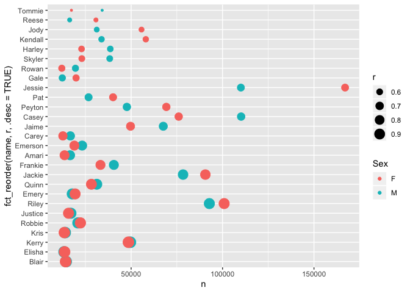
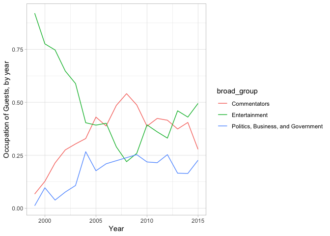
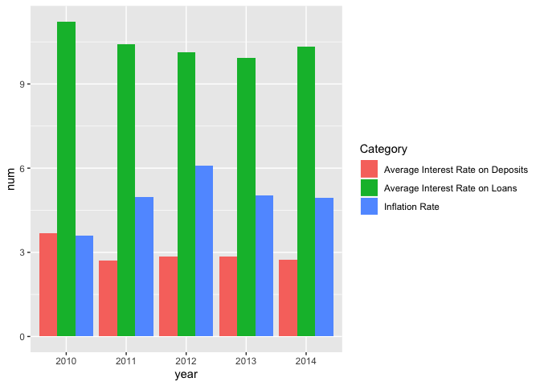

```r
library(tidyverse)
library(lubridate)
library(ggmap)
library(fivethirtyeight)
library(babynames)
library(nycflights13)
```

## Activity A7: Pivoting
*Exercise 3.1* Use the babynames dataset to find the names that are used roughly equally for males and females. Take the following steps, but you do NOT need to create a separate R code chunk for each step. That is, feel free to do many (or all) of these steps in one code chunk.

a. Summarize the data so there is one row for each name/sex combination. Compute both the number of times and proportion of time that name is used within sex.


```r
t<-babynames%>% 
  group_by(name, sex) %>% 
  summarise(n=sum(n),p=sum(prop)) %>% 
  pivot_wider(id_cols=name,names_from = sex, values_from =c(n,p),values_fill = list(n=0,p=0))

t
```

```
## # A tibble: 97,310 x 5
## # Groups:   name [97,310]
##    name        n_M   n_F        p_M        p_F
##    <chr>     <int> <int>      <dbl>      <dbl>
##  1 Aaban       107     0 0.0000525  0         
##  2 Aabha         0    35 0          0.0000180 
##  3 Aabid        10     0 0.00000486 0         
##  4 Aabir         5     0 0.00000248 0         
##  5 Aabriella     0    32 0          0.0000164 
##  6 Aada          0     5 0          0.00000257
##  7 Aadam       254     0 0.000124   0         
##  8 Aadan       130     0 0.0000625  0         
##  9 Aadarsh     199     0 0.0000956  0         
## 10 Aaden      4653     5 0.00223    0.00000247
## # … with 97,300 more rows
```

b. Create a single row for each name and separate variables for the number of times that name is used for males and females. Be sure to check the pivot_wider() documenation because you will need to fill in missing values with zeros.

c. Use these two columns to compute a third column that gives the ratio between these two columns. Keep the smaller of the ratio between male to female and female to male. HINT: see pmin() function.

d. Filter the data to names with frequency greater than 10,000 for both males and females, sort by the ratio from largest to smallest, and keep only those with a ratio of 0.5 or greater (no more than 2 to 1).

e. Transform the data back to a longer format and save the data as male_female_names_longer.

f. Make a plot of these names. Represent how often the name was used as points with name on the y-axis and count on the x-axis. Color the points by sex and change the size to reflect the ratio. EXTRA: arrange the names on the plot from largest to smallest ratio (hint: fct_reorder()).


```r
male_female_names_longer0 <- babynames%>% 
  group_by(name, sex) %>% 
  summarise(n=sum(n)) %>% 
  pivot_wider(names_from = sex, values_from = n,values_fill = list(n=0)) %>% 
  mutate(r=pmin(M/F,F/M)) %>% 
  filter(M > 10000, F > 10000) %>% 
  arrange(desc(r)) %>% 
  filter(r>=0.5)

male_female_names_longer0
```

```
## # A tibble: 27 x 4
## # Groups:   name [27]
##    name        M      F     r
##    <chr>   <int>  <int> <dbl>
##  1 Blair   14470  14195 0.981
##  2 Elisha  13330  13599 0.980
##  3 Kerry   49596  48534 0.979
##  4 Kris    13982  13490 0.965
##  5 Robbie  20863  22264 0.937
##  6 Justice 17080  15782 0.924
##  7 Riley   92789 100881 0.920
##  8 Emery   17779  19367 0.918
##  9 Quinn   31230  28283 0.906
## 10 Jackie  78405  90604 0.865
## # … with 17 more rows
```

```r
 male_female_names_longer<-male_female_names_longer0 %>% 
  select(name, M, F) %>% 
  pivot_longer(cols= -name,names_to = "Sex",values_to = "n")%>% 
  inner_join(male_female_names_longer0, by="name") %>%
  select(-c(M,F)) 
 
male_female_names_longer
```

```
## # A tibble: 54 x 4
## # Groups:   name [27]
##    name   Sex       n     r
##    <chr>  <chr> <int> <dbl>
##  1 Blair  M     14470 0.981
##  2 Blair  F     14195 0.981
##  3 Elisha M     13330 0.980
##  4 Elisha F     13599 0.980
##  5 Kerry  M     49596 0.979
##  6 Kerry  F     48534 0.979
##  7 Kris   M     13982 0.965
##  8 Kris   F     13490 0.965
##  9 Robbie M     20863 0.937
## 10 Robbie F     22264 0.937
## # … with 44 more rows
```

```r
male_female_names_longer %>% 
  ggplot(aes(x=n, y=fct_reorder(name,r,.desc=TRUE),color= Sex, size=r))+
  geom_point() 
```

<!-- -->


*Exercise 3.2* Create a table containing 19 columns. The first column should have the ten guests with the highest number of total apperances on the show, listed in descending order of number of appearances. The next 17 columns should show the number of appearances of the corresponding guest in each year from 1999 to 2015 (one per column). The final column should show the total number of appearances for the corresponding guest over the entire duration of the show (these entries should be in decreasing order). Hint: you will need to summarize the data and join it back to create all the columns.


```r
temp<-daily_show_guests %>% 
  group_by(raw_guest_list) %>% 
  summarise(n=n()) %>% 
  arrange(desc(n)) %>% 
  top_n(10)
```

```
## Selecting by n
```

```r
daily_show_guests%>%
  select(raw_guest_list, year) %>%
  group_by(year,raw_guest_list) %>%
  summarise(num=n()) %>%
  arrange(year) %>% 
  ungroup() %>% 
  pivot_wider(id_cols=raw_guest_list, names_from = year, values_from = num,values_fill = list(num=0)) %>% 
  inner_join(temp) %>% 
  arrange(desc(n))
```

```
## Joining, by = "raw_guest_list"
```

```
## # A tibble: 10 x 19
##    raw_guest_list `1999` `2000` `2001` `2002` `2003` `2004` `2005` `2006`
##    <chr>           <int>  <int>  <int>  <int>  <int>  <int>  <int>  <int>
##  1 Fareed Zakaria      0      0      1      0      1      2      2      2
##  2 Denis Leary         1      0      1      2      1      0      0      1
##  3 Brian Williams      0      0      0      0      1      1      2      1
##  4 Paul Rudd           1      0      1      1      1      1      1      0
##  5 Ricky Gervais       0      0      0      0      0      0      1      2
##  6 Tom Brokaw          0      0      0      1      0      2      1      0
##  7 Richard Lewis       1      0      2      2      1      1      0      0
##  8 Will Ferrell        0      1      1      0      1      1      1      1
##  9 Bill O'Reilly       0      0      1      1      0      1      1      0
## 10 Reza Aslan          0      0      0      0      0      0      1      2
## # … with 10 more variables: `2007` <int>, `2008` <int>, `2009` <int>,
## #   `2010` <int>, `2011` <int>, `2012` <int>, `2013` <int>, `2014` <int>,
## #   `2015` <int>, n <int>
```

*Exercise 3.3* In order to help you recreate the first figure from the article, I have added a new variable with three broader groups: (i) entertainment; (ii) politics, business, and government, and (iii) commentators. Using the group assignments contained in the broad_group variable, recreate the graphic from the article, with three different lines showing the fraction of guests in each group over time.


```r
DailyGroups <- read_csv("https://www.macalester.edu/~dshuman1/data/112/daily-group-assignment.csv")
```

```
## Parsed with column specification:
## cols(
##   group = col_character(),
##   broad_group = col_character()
## )
```

```r
daily_show_guests %>% 
  inner_join(DailyGroups, by="group") %>% 
  select(broad_group,show,year) %>% 
  group_by(year, broad_group) %>% 
  summarise(n=n()) %>% 
  mutate(sum=sum(n), p=n/sum) %>% 
  ggplot(aes(x=year, y=p, color=broad_group))+
  geom_line()+
  theme_light()+
  labs(x="Year", y="Occupation of Guests, by year")
```

<!-- -->


*Exercise 3.4* The Lesotho dataset from opendataforafrica.org has different years in different columns. Make a side-by-side bar chart with the year on the horizontal axis, and three side-by-side vertical columns for average interest rate on deposits, average interest rate on loans, and inflation rate for each year.

```r
Lesotho <- read_csv("https://www.macalester.edu/~dshuman1/data/112/Lesotho.csv")
```

```
## Parsed with column specification:
## cols(
##   Category = col_character(),
##   `2010` = col_double(),
##   `2011` = col_double(),
##   `2012` = col_double(),
##   `2013` = col_double(),
##   `2014` = col_double()
## )
```

```r
Lesotho %>% 
  pivot_longer(cols = -Category, names_to = "year", values_to = "num") %>% 
  filter(Category %in% c("Average Interest Rate on Loans","Average Interest Rate on Deposits","Inflation Rate"))%>%
  ggplot(aes(x=year, y=num, fill=Category))+
  geom_bar(stat='identity',position='dodge')
```

<!-- -->

```r
# geom_col(position='dodge)
```

