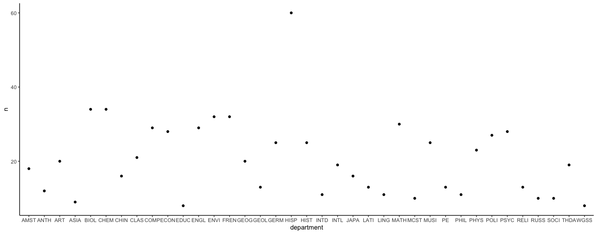

## Shiny APP Link: https://charles-zhang.shinyapps.io/9_Shiny_app/

## Activity A14: Introduction to Scraping


```r
library(tidyverse)
library(rvest) 
library(robotstxt) 
library(formattable)
```

**Exercise 1.1** Find the correct selectors for the following fields. Make sure that each matches 762 results:

1. Course Number
2. Course Name
3. Day
4. Time
5. Room
6. Instructor
7. Avail. / Max
8. General Education Requirements (make sure you only match 762; beware of the Mac copyright banner at the bottom of the page!)
9. Description
Then, put all this information into one data frame. Do not include any extraneous information like “Instructor:”.


```r
fall2017 <- read_html("https://www.macalester.edu/registrar/schedules/2017fall/class-schedule/#crs10008")

course_nums <- 
  fall2017 %>%
  html_nodes(".class-schedule-course-number") %>%
  html_text()

course_names <- 
  fall2017 %>%
  html_nodes(".class-schedule-course-title") %>%
  html_text()

course_days <- fall2017 %>%
  html_nodes("td.class-schedule-label:nth-child(3)") %>% 
  html_text() %>% 
  str_sub(start = 7)
  
course_time <- fall2017 %>% 
  html_nodes("td.class-schedule-label:nth-child(4)") %>%
  html_text() %>% 
  str_sub(start = 7)
  
course_room <- fall2017 %>% 
  html_nodes("td.class-schedule-label:nth-child(5)") %>%
  html_text() %>% 
  str_sub(start = 7)
  
course_instructor <- fall2017 %>% 
  html_nodes("td.class-schedule-label:nth-child(6)") %>%
  html_text() %>% 
  str_sub(start = 13)

course_av <- fall2017 %>% 
  html_nodes("td.class-schedule-label:nth-child(7)") %>%
  html_text() %>% 
  str_sub(start = 14)

course_ger <- fall2017 %>% 
  html_nodes("div.expandable p:nth-child(2)") %>%
  html_text() %>% 
  str_sub(start = 61)

  
course_descriptios <- fall2017 %>% 
  html_nodes("div.expandable p:nth-child(1)") %>%
  html_text() %>% 
  str_sub(start = 30)
```

```r
course_df <- tibble(number=course_nums, name=course_names, day=course_days, time=course_time, room=course_room, instructor=course_instructor, avil_max=course_av, general_education_requirement=course_ger, description=course_descriptios)

course_df
```

```
## # A tibble: 762 x 9
##    number name  day   time  room  instructor avil_max general_educati…
##    <chr>  <chr> <chr> <chr> <chr> <chr>      <chr>    <chr>           
##  1 AMST … Expl… W     07:0… ARTC… Gutierrez… Closed … U.S. Identities…
##  2 AMST … The … MWF   09:4… NEIL… Karin Agu… 0 / 16   U.S. Identities…
##  3 AMST … Crit… MWF   02:2… OLRI… Nathan Ti… 13 / 20  ""              
##  4 AMST … Poli… MWF   09:4… CARN… Lesley La… Closed … U.S. Identities…
##  5 AMST … In M… MWF   01:1… MAIN… Crystal M… 2 / 20   U.S. Identities…
##  6 AMST … Narr… MWF   10:5… MAIN… Crystal M… Closed … ""              
##  7 AMST … Race… MWF   01:1… NEIL… Jonathan … Closed … ""              
##  8 AMST … Race… M     07:0… NEIL… Karin Agu… Closed … U.S. Identities…
##  9 AMST … Afri… MWF   09:4… CARN… Sarah Bel… 10 / 20  U.S. Identities…
## 10 AMST … Publ… TR    09:4… NEIL… Harris, S… 0 / 15   ""              
## # … with 752 more rows, and 1 more variable: description <chr>
```

> First six rows of the data frame


```r
formattable(head(course_df),align =c("c", "c"), list(`Indicator Name` = formatter("span", style =~style(color = "black",font.weight = "bold"))))
```


<table class="table table-condensed">
 <thead>
  <tr>
   <th style="text-align:center;"> number </th>
   <th style="text-align:center;"> name </th>
   <th style="text-align:center;"> day </th>
   <th style="text-align:center;"> time </th>
   <th style="text-align:center;"> room </th>
   <th style="text-align:center;"> instructor </th>
   <th style="text-align:center;"> avil_max </th>
   <th style="text-align:center;"> general_education_requirement </th>
   <th style="text-align:center;"> description </th>
  </tr>
 </thead>
<tbody>
  <tr>
   <td style="text-align:center;"> AMST 101-01 </td>
   <td style="text-align:center;"> Explorations of Race and Racism </td>
   <td style="text-align:center;"> W </td>
   <td style="text-align:center;"> 07:00 pm-10:00 pm </td>
   <td style="text-align:center;"> ARTCOM 102 </td>
   <td style="text-align:center;"> Gutierrez, Harris </td>
   <td style="text-align:center;"> Closed -5 / 25 </td>
   <td style="text-align:center;"> U.S. Identities and Differences </td>
   <td style="text-align:center;"> The main objectives of this introductory course are: to explore the historical construction of racial categories in the United States; to understand the systemic impact of racism on contemporary social processes; to consider popular views about race in the light of emerging scholarship in the field; and to develop an ability to connect personal experiences to larger, collective realities. We will engage several questions as a group: What are the historical and sociological foundations of racial categories? When does focusing on race make someone racist? What is white privilege, and why does it matter? All students will be asked to think and write about their own racial identity. This course, or its equivalent, is required for majors and minors.  (4 credits) </td>
  </tr>
  <tr>
   <td style="text-align:center;"> AMST 103-01 </td>
   <td style="text-align:center;"> The Problems of Race in US Social Thought and Policy </td>
   <td style="text-align:center;"> MWF </td>
   <td style="text-align:center;"> 09:40 am-10:40 am </td>
   <td style="text-align:center;"> NEILL 111 </td>
   <td style="text-align:center;"> Karin Aguilar-San Juan </td>
   <td style="text-align:center;"> 0 / 16 </td>
   <td style="text-align:center;"> U.S. Identities and Differences Writing WA </td>
   <td style="text-align:center;"> In this discussion-based and residential course, we will explore the paradox of a society in which people are increasingly aware of patterns of racism and yet still unable to see or explain how those systems and patterns are connected to everyday life. As awareness increases, why are we not able to develop effective or meaningful responses?Our interdisciplinary and integrative approach will employ multiple methods of inquiry and expression, including: self-reflective essays and maps; a scavenger hunt along University Avenue; library research; and deep, critical analysis of arguments about race/ethnicity/assimilation/multiculturalism.We will practice engaging in open-ended conversations so that we might discover the questions that truly matter to each of us. To fulfill the WA general education writing requirement, this course will invite you to produce at least 20 pages of college-level writing through various assignments. Each writing assignment will strengthen your use of evidence and argumentation, and will involve drafts, feedback, in person conference, and revision.Class meets MWF, 9:40 am - 10:40 am in Neill Hall 111Writing designation:  WALiving arrangements:  Single gender rooms, co-ed floor. </td>
  </tr>
  <tr>
   <td style="text-align:center;"> AMST 200-01 </td>
   <td style="text-align:center;"> Critical Methods for American Studies Research </td>
   <td style="text-align:center;"> MWF </td>
   <td style="text-align:center;"> 02:20 pm-03:20 pm </td>
   <td style="text-align:center;"> OLRI 205 </td>
   <td style="text-align:center;"> Nathan Titman </td>
   <td style="text-align:center;"> 13 / 20 </td>
   <td style="text-align:center;">  </td>
   <td style="text-align:center;"> This course will introduce students to interdisciplinary research approaches to the study of race, ethnicity, and other categories of difference. Students will learn to conceptualize and design research projects, and will obtain hands-on experience in executing different methods. The course will also consider the critiques of systems of knowledge production and research approaches that have been informed by scholars from fields such as African American history, gender studies, and critical race studies, as well as from the disciplines. The goal is to develop an understanding of the assumptions embedded in many fields of inquiry, and to learn to apply critical approaches to important research questions. </td>
  </tr>
  <tr>
   <td style="text-align:center;"> AMST 203-01 </td>
   <td style="text-align:center;"> Politics and Inequality: American Welfare State </td>
   <td style="text-align:center;"> MWF </td>
   <td style="text-align:center;"> 09:40 am-10:40 am </td>
   <td style="text-align:center;"> CARN 204 </td>
   <td style="text-align:center;"> Lesley Lavery </td>
   <td style="text-align:center;"> Closed 0 / 25 </td>
   <td style="text-align:center;"> U.S. Identities and Differences Writing WP </td>
   <td style="text-align:center;"> Americans, at least since the Founding era, have cherished the ideal of political equality.  Unlike European nations, the United States did not inherit economic class distinctions from a feudal past. But time and again, American social reformers and mass movements have highlighted inconsistencies between the value of equality and the actual practice of democracy. Through the extension of rights to citizens who were previously excluded or treated as second-class citizens, such as women and African Americans, the polity has become more inclusive. But over the last three decades American citizens have grown increasingly unequal in terms of income and wealth.  The central question posed by this course is the implications of such vast economic inequality for American democracy. Do these disparities between citizens curtail, limit, and perhaps threaten the functioning of genuinely representative governance?  In this course will 1) Explore what other social scientists, mostly economists and sociologists, know about contemporary inequality, particularly in terms of its causes, manifestation, and socio-economic effects; 2) Consider the concept of inequality in political theory and in American political thought, and; 3) Examine the current relationship between economic inequality and each of three major aspects of the American political  system: political voice, representation, and public policy. Cross-listed as Political Science 203. (4 Credits) </td>
  </tr>
  <tr>
   <td style="text-align:center;"> AMST 219-01 </td>
   <td style="text-align:center;"> In Motion: African Americans in the United States </td>
   <td style="text-align:center;"> MWF </td>
   <td style="text-align:center;"> 01:10 pm-02:10 pm </td>
   <td style="text-align:center;"> MAIN 010 </td>
   <td style="text-align:center;"> Crystal Moten </td>
   <td style="text-align:center;"> 2 / 20 </td>
   <td style="text-align:center;"> U.S. Identities and Differences </td>
   <td style="text-align:center;"> In Motion is an introduction to modern African American History from slavery to contemporary times. In Motion emphasizes the idea that both African Americans and the stories of their lives in the United States are fluid, varied and continually being reinterpreted. Rather than a strict chronological survey, this course is organized thematically. Some of the important themes include movement/mobility/migration; work/labor; resistance to systems of oppression; gender/sexuality/culture/performance; politics/citizenship; and sites of (re)memory. While the course is geographically situated in the United States, we will also consider African American life, culture, thought and resistance in global perspectives. In this course, students will read important historical texts, both primary and secondary, engage in discussion, and write essays that ask them to critically engage the history of African Americans in the US. Cross-listed with History 219. 4 credits. </td>
  </tr>
  <tr>
   <td style="text-align:center;"> AMST 229-01 </td>
   <td style="text-align:center;"> Narrating Black Women's Resistance </td>
   <td style="text-align:center;"> MWF </td>
   <td style="text-align:center;"> 10:50 am-11:50 am </td>
   <td style="text-align:center;"> MAIN 001 </td>
   <td style="text-align:center;"> Crystal Moten </td>
   <td style="text-align:center;"> Closed 4 / 14 </td>
   <td style="text-align:center;">  </td>
   <td style="text-align:center;"> This course examines traditions of 20th century African American women’s activism and the ways in which they have changed over time.  Too often, the narrative of the “strong black woman” infuses stories of African American women’s resistance which, coupled with a culture of dissemblance, makes the inner workings of their lives difficult to imagine. This course, at its heart, seeks to uncover the motivations, both personal and political, behind African American women’s activism. It also aims to address the ways in which African American women have responded to the pressing social, economic, and political needs of their diverse communities. The course also asks students to consider narrative, voice and audience in historical writing, paying particular attention to the ways in which black women’s history has been written over the course of the twentieth century. Cross-listed with History 229 and Women's and Gender Studies 229. 4 credits. </td>
  </tr>
</tbody>
</table>

**Exercise 1.2** Create a chart that shows the number of sections offered per department. Hint: The department is a substring of the course number. Yes, COMP and MATH are the same department, but for this exercise you can just show the results by four letter department code, e.g., with COMP and MATH separate.


```r
course <- course_df %>%  
  separate(number, into = c("department", "number", "section")) 

course %>% 
  group_by(department) %>% 
  summarise(n=n()) %>% 
  ggplot(aes(x=department, y=n))+
  geom_point()+
  theme_classic()
```

<!-- -->


**Exercise 1.3** Analyze the typical length of course names by department. To do so, create a dplyr pipeline that creates a new data table based on your courses data table, with the following changes:

1. New columns for the length of the title of a course and the length of the description of the course. Hint: str_length.
2. Remove departments that have fewer than 10 sections of courses. To do so, group by department, then remove observations in groups with fewer than 10 sections (Hint: use filter with n()). Then ungroup the data.
3. Create a visualization of the differences across groups in lengths of course names or course descriptions. Think carefully about the visualization you should be using!


```r
course_analysis <- course %>% 
  mutate(title_len = str_length(name)) %>% 
  group_by(department) %>% 
  filter(n()>=10) %>% 
  ungroup() 

course_analysis%>% 
  ggplot(aes(x=department, y=title_len))+
  geom_boxplot()+
  theme_classic()
```

<!-- -->


