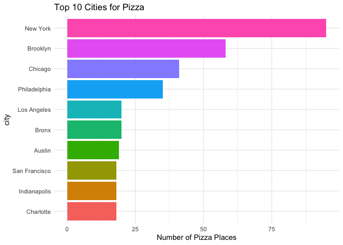
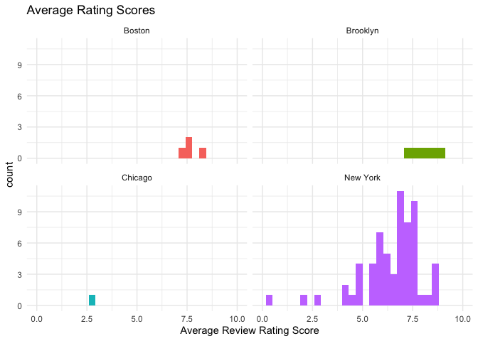
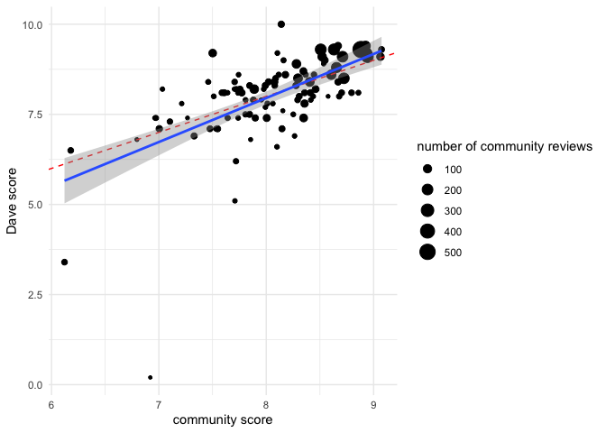
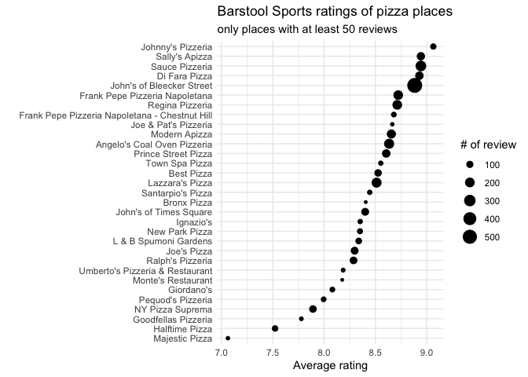
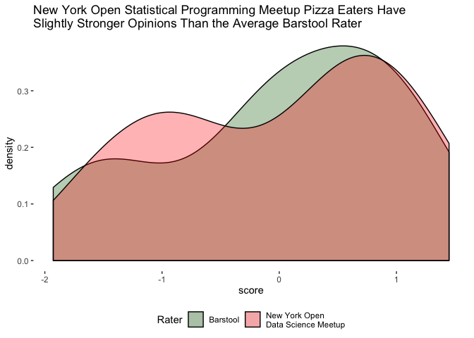

This is ***COMP/STAT 112 Intro to the Data Science*** final group project at Macalester College.  
It seems like everyone has a favorite pizzeria. Whether it’s the one that delivers until 2 AM, the one
with the best sauce, or the really cheap one down the block, it’s very hard to find a pizzeria that everyone will like. Using some data from TidyTuesday’s Pizza Party dataset, we tried to solve this problem by R. For more interactive graphs and maps with Leaflet, please visit my [Github Repository](https://github.com/CZhang666/STAT-COMP112/tree/master/Final-Project) or download the [html file](https://github.com/CZhang666/STAT-COMP112/blob/master/Final-Project/Final.html).

# **COMP 112 Intro to the Data Science Final Project**
## **Pizza Party**
#### Charles Zhang, Jinghan Zhou, Roan Floer-Martinez,Xi Feng
#### 12/16/2019

### **Introduction**
#### &nbsp;&nbsp;&nbsp;&nbsp;&nbsp;&nbsp;&nbsp;&nbsp; It seems like everyone has a favorite pizzeria. Whether it’s the one that delivers until 2 AM, the one with the best sauce, or the really cheap one down the block, it’s very hard to find a pizzeria that everyone will like. Using some data from TidyTuesday’s Pizza Party dataset, we tried to solve this problem. It contains three datasets, one from DataFiniti which has more than 10,000 pizza places from across the country; one from the Barstool Sports magazine which has price categories, locations, and reviews from Barstool critics and community members; and a dataset from Jared Lander, who surveyed people on New York Pizzerias and asked people to rate them on a six point like scale. We have used all three datasets, and it’s given us a pretty good sense of the best pizza in New York. We started out by mapping the DataFiniti dataset. Obviously it doesn’t include every single pizzeria in the country, and it doesn’t have franchises like Domino’s. However, it shows fairly well where pizza places are concentrated in this country. 

### **Data Exploration**

#### &nbsp;&nbsp;&nbsp;&nbsp;&nbsp;&nbsp;&nbsp;&nbsp; Since there is so much regional pride in pizza, and to get a better sense of where pizzerias are concentrated, we then sorted and graphed our cities by the number of pizza places. It’s important to note that, in this dataset, the different boroughs of New York City are considered to be different cities. Regardless, Manhattan has by far the most pizzerias, with nearly 100. Brooklyn comes in second with just over 50, and Chicago and Philadelphia have about 30 each. 

<!-- -->

####	&nbsp;&nbsp;&nbsp;&nbsp;&nbsp;&nbsp;&nbsp;&nbsp; We then looked at four of the top cities for pizza in the country, Boston, Brooklyn, Chicago, and New York. We compared the average ratings for pizzerias. Most of the cities’ averages were around 6 or 7, except Chicago. I guess not even Chicagoans like Deep Dish! As was expected, New York had by far the most pizzerias. 

<!-- -->

### **Rating Methods Comparison**

#### &nbsp;&nbsp;&nbsp;&nbsp;&nbsp;&nbsp;&nbsp;&nbsp; Since we have three different rating systems, we wondered if it’s even possible to get a reliable conclusion from them. To check this, we compared the distribution of ratings across the different datasets. All three had an average of roughly 7.5 and very similar bell curve patterns, which shows that there was at least some consistency in the rating scales. 

<!-- -->

#### &nbsp;&nbsp;&nbsp;&nbsp;&nbsp;&nbsp;&nbsp;&nbsp; With that in mind, we tried to find the best pizza in New York. First, we compared Dave’s ratings with the community average across the whole dataset. 

#### &nbsp;&nbsp;&nbsp;&nbsp;&nbsp;&nbsp;&nbsp;&nbsp; From this graph above it seems like community and Dave average rating scores have some differences rating pizza places. However, we considered that the number of reviewers might influence the final results. Therefore, we filtered the community scores which at leaste have 50 reviewers, then the relationship between Dave rating score and community score we get is very close. 

<!-- -->

#### &nbsp;&nbsp;&nbsp;&nbsp;&nbsp;&nbsp;&nbsp;&nbsp; We then wondered how much difference there was between the barstool raters and the community raters. we filtered the Barstool data to include only those pizzerias that are present in the Jared set. Due to common pizzeria names, we also filterd out non-New York cities. Since The Jared pizza poll uses a 6 point likert scale: Excellent, Good, Average, Poor, Fair, and Never Again, which captures the response as a string, so we first transformedd the factors to a numerical scale. Then we normalized the data by centering and scaling each data set’s review scores, showing below. We get that csommunity members on the whole tended to rate pizza more harshly, and we considered this in our final analysis. 

<!-- -->

### **Results**

#### &nbsp;&nbsp;&nbsp;&nbsp;&nbsp;&nbsp;&nbsp;&nbsp; Our data came with ratings for various pizza places. We wanted to find the best pizza places in New York based off this. However, we didn't just want to calculate the average rating because we think an extreme rating can be more telling. As a result, we calculated the proportion of all ratings among the overall reviews and sorted by the highest proportion of reviews rating the pizzerias as "excellent". Of those ten, only Little Italy Pizza had reviewers who said they would never go back and four had no "poor" ratings either. Patsy's pizza was the winner with 2/3rds of reviewers calling its pizza "excellent". 

<!-- -->

#### &nbsp;&nbsp;&nbsp;&nbsp;&nbsp;&nbsp;&nbsp;&nbsp; Then, we combined two graphs, which gives us, we think, a good sense of the best pizza in the country. 

#### &nbsp;&nbsp;&nbsp;&nbsp;&nbsp;&nbsp;&nbsp;&nbsp; Moreover, these graph is helpful, but they do tell us how many people rated a certain pizzeria. Without a doubt, it is important to consider the number of ratings a place received in considering how accurate a rating is. To account for this, we graphed the restaurants in the barstool dataset and sized their points by the number of ratings. This helps argue the objectivity of any single rating. 

<!-- -->

### **Challenges and Further Study**
- Datasets don’t always overlap
- Ratings are inherently subjective
- Pizzerias open and close all the time
- How do you account for different regional styles of pizza?
- Only one dataset contains information on prices

### **Reference**

Richards, Tyler, [*Adventures in Barstool’s Pizza Data*](https://towardsdatascience.com/adventures-in-barstools-pizza-data-9b8ae6bb6cd1
), May 11, 2019

Lander, Jared, [*Jared Data Set*](https://github.com/rfordatascience/tidytuesday/tree/master/data/2019/2019-10-01)

 
 
 
