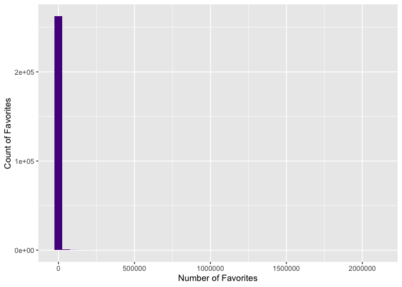
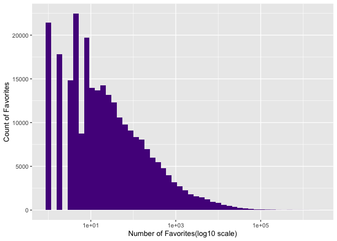
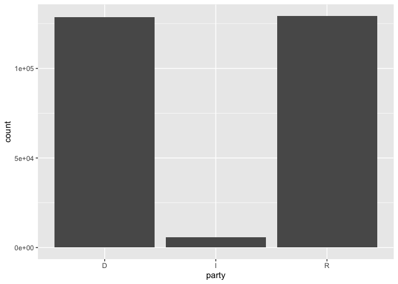
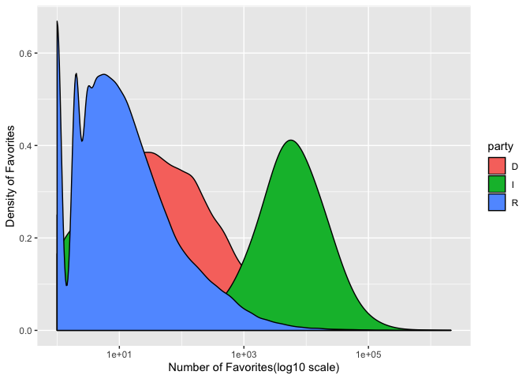
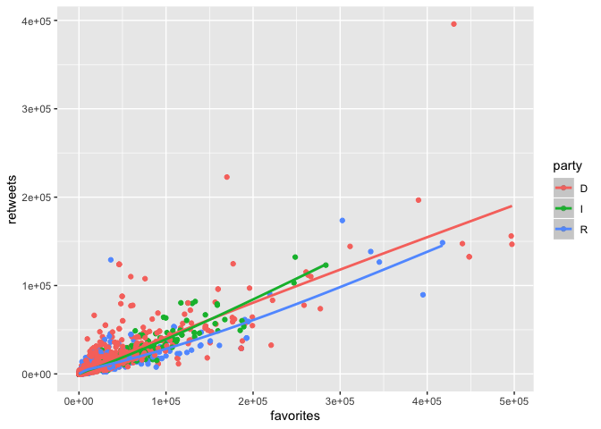
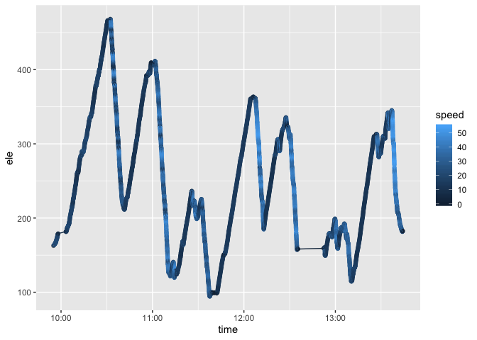
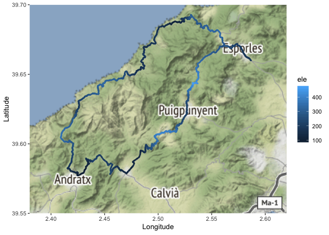

# Quizzes
---
title: "Data Science Quiz 1"
author: "Charles Zhang"
output: 
  html_document:
    keep_md: yes
---


```r
library(ggmap)
library(ggridges)
library(ggthemes)
library(tidyverse)
```

# Politicians on Twitter

The code below will read in data on tweets from senators in the US. Only tweets with at least one favorite are included. The data is named `senators`. 


```r
url <- "https://raw.githubusercontent.com/fivethirtyeight/data/master/twitter-ratio/senators.csv"

senators <- read_csv(url) %>%
  mutate(
    party = as.factor(party),
    state = as.factor(state),
    created_at = as.POSIXct(created_at, tz = "GMT", format = "%m/%d/%Y %H:%M"),
    text =  gsub("[^\x01-\x7F]", "", text)) %>%
  select(created_at, user, everything(), -text, -url) %>% 
  filter(favorites>0)
```


(@) Create a histogram that examines the distribution of `favorites`. Do the following: a) Fill in the bars with a color, one that isn't too bright. b) Create helpful x and y axis labels. c) Use an appropriate number of bins or binsize.


```r
ggplot(data=senators)+
  geom_histogram(aes(x=favorites), fill='purple4', binwidth = 50000)+
  labs(x="Number of Favorites", y="Count of Favorites")
```

<!-- -->


(@) Modify the histogram from the previous problem so that the x-axis is on the log scale (HINT: use `scale_x_?????()`). What features do you see in this plot that were hard to see in the previous plot?


```r
ggplot(data=senators)+
  geom_histogram(aes(x=favorites), fill='purple4', bins = 50)+
  scale_x_log10()+
  labs(x="Number of Favorites(log10 scale)", y="Count of Favorites")
```

<!-- -->

```r
# In this figure, it is more clear for visualization of the frequency about the number of favorites, and the scale is much more appropriate to see the skewness or trend for this data set which contains the varied range and large numbers(few points are much larger than the bulk of the data). 
```


(@) Create a barplot that shows the number of tweets by party. 


```r
ggplot(senators)+
  geom_bar(aes(x=party))
```

<!-- -->


(@) Create a graph that examines the distribution of favorites by party. Use the log scale on the x-axis and label x and y axes appropriately.


```r
ggplot(senators, aes(x=favorites, fill=party))+
  geom_density()+
  scale_x_log10()+
  labs(x="Number of Favorites(log10 scale)", y="Density of Favorites")
```

<!-- -->


(@) We are going to filter the data to tweets with fewer than 500,000 favorites. Put the code into the R code chunk. Then pipe into your `ggplot` code and don't use a `data=` argument. Create a scatterplot to examine the relationship between favorites (x-axis) and retweets, and color the points by party. Add a smooth line for each party. Comment on what you observe.

```
senators %>% 
  filter(favorites < 500000)
```


```r
senators %>% 
  filter(favorites < 500000) %>% 
  ggplot(aes(x=favorites, y=retweets, color=party))+
  geom_point()+
  geom_smooth()
```

<!-- -->

```r
# Observation: overall, the trends of the relations between favorites and retweets of three parties are the same, which is an increasing relationship. 
```


# Cycling in Mallorca, Spain

The data below are from a bike ride I went on in Mallorca, Spain in spring of 2018.


```r
mallorca_bike_day7 <- read_csv("https://www.dropbox.com/s/zc6jan4ltmjtvy0/mallorca_bike_day7.csv?dl=1") %>% 
  select(1:4, speed)
```


(@) Plot the elevation (`ele`) over `time` and color by `speed`, using both points and a line to connect the points. When was I fastest? Slowest? What do you think happened around 12:45?


```r
ggplot(mallorca_bike_day7, aes(x=time, y=ele, color=speed))+
  geom_point()+
  geom_line()
```

<!-- -->

```r
# You were fast while going down(elevation decreased) and slow while going up(elevation increased). Approximately, you were fastest at 12:15 and slowest between 12:15 to 12:20(when speed is not zero). At 12:45, you probably stopped and rested.
```

(@) The following code creates the base map. On top of that, plot the route I took using the longitude (`lon`) and latitude (`lat`). Color them by elevation. Make the size of the points a little smaller to not overwhelm the map.


```r
mallorca_map <- get_stamenmap(
    bbox = c(left = 2.38, bottom = 39.55, right = 2.62, top = 39.7), 
    maptype = "terrain",
    zoom = 11
)

ggmap(mallorca_map)+
  geom_point(data=mallorca_bike_day7, 
             aes(x=lon,y=lat, color=ele), 
             alpha=.7, size = .5) +
  labs(x="Longitude", y="Latitude")
```

<!-- -->

---
title: "Quiz 2"
author: "Charles Zhang"
output: 
  html_document:
    keep_md: yes
---


```r
library(tidyverse)
library(babynames)
library(lubridate)
library(nycflights13) #may need to install but likely not
```

GENERAL ADVICE: 

a) It is better to have partial answers for all problems than complete answers for some but no answers for others.  

b) Think about all the steps you need to take before jumping right into the code. If you find yourself getting stuck on the code, write out how you would do this by hand - I'll give you some partial credit!  

c) SAVE AND KNIT OFTEN!!!

The following exercises use the `babynames` dataset. 

(@) Display a table with the 5 years with the highest proportions of females named "Lisa", order them from largest to smallest proportion and only keep the year and the proportion.


```r
babynames %>% 
  filter(name=="Lisa", sex=="F") %>% 
  arrange(desc(prop)) %>% 
  top_n(5) %>% 
  select(year, prop)
```

```
## # A tibble: 5 x 2
##    year   prop
##   <dbl>  <dbl>
## 1  1965 0.0330
## 2  1966 0.0324
## 3  1967 0.0305
## 4  1968 0.0290
## 5  1963 0.0282
```

(@) For each decade, find how many of the years had more than 1\% of males named "Christopher". For example, there were not any years from 1880 - 1889 that had more than 1\% of males named "Christopher". So, for the 1880's, the answer would be 0. The final table should have a column called `decade` and a column called `years_christopher` with the number of years in that decade with more than 1\% of males named "Christopher". Only display the decades where the number is greater than 0. HINT: You can compute decade with `decade = floor(year/10)*10`.


```r
babynames %>% 
  mutate(decade = floor(year/10)*10) %>%
  filter(name=="Christopher", sex=="M") %>% 
  mutate(larger_than_1_percent=prop>0.01) %>% 
  group_by(decade) %>% 
  summarise(years_christopher=sum(larger_than_1_percent)) %>% 
  filter(years_christopher > 0)
```

```
## # A tibble: 5 x 2
##   decade years_christopher
##    <dbl>             <int>
## 1   1960                 5
## 2   1970                10
## 3   1980                10
## 4   1990                10
## 5   2000                 3
```

The following exercises use the `flights`, `airlines`, and `airport` datasets from the `nycflights13` package. It contains flight data from 2013 for the three airports around New York City. Also, there is some missing data, so please use the dataset `flights_no_na`, rather than `flights`, for all your analysis!


```r
data("flights")
data("airlines")
data("airports")
```


```r
flights_no_na <-
  flights %>% 
  drop_na(arr_delay)
```


(@) Use the `flights_no_na` data to find in which month (using month number is fine) there were the longest arrival delays, on average. Arrange the results from longest to shortest average delays.


```r
flights_no_na %>% 
  group_by(month) %>% 
  summarise(avr_delay=mean(arr_delay)) %>% 
  arrange(desc(avr_delay))
```

```
## # A tibble: 12 x 2
##    month avr_delay
##    <int>     <dbl>
##  1     7    16.7  
##  2     6    16.5  
##  3    12    14.9  
##  4     4    11.2  
##  5     1     6.13 
##  6     8     6.04 
##  7     3     5.81 
##  8     2     5.61 
##  9     5     3.52 
## 10    11     0.461
## 11    10    -0.167
## 12     9    -4.02
```
> There were the longest arrival delays on average in July. 

(@) Use the `flights_no_na` and `airlines` data to find which airline (use the name, not the abbreviation) had the longest delays, from shortest to longest.


```r
flights_no_na %>% 
  inner_join(airlines, by = "carrier") %>% 
  group_by(name) %>% 
  summarise(avr_delay=mean(arr_delay)) %>% 
  arrange(avr_delay) 
```

```
## # A tibble: 16 x 2
##    name                        avr_delay
##    <chr>                           <dbl>
##  1 Alaska Airlines Inc.           -9.93 
##  2 Hawaiian Airlines Inc.         -6.92 
##  3 American Airlines Inc.          0.364
##  4 Delta Air Lines Inc.            1.64 
##  5 Virgin America                  1.76 
##  6 US Airways Inc.                 2.13 
##  7 United Air Lines Inc.           3.56 
##  8 Endeavor Air Inc.               7.38 
##  9 JetBlue Airways                 9.46 
## 10 Southwest Airlines Co.          9.65 
## 11 Envoy Air                      10.8  
## 12 SkyWest Airlines Inc.          11.9  
## 13 Mesa Airlines Inc.             15.6  
## 14 ExpressJet Airlines Inc.       15.8  
## 15 AirTran Airways Corporation    20.1  
## 16 Frontier Airlines Inc.         21.9
```

```r
flights_no_na %>% 
  inner_join(airlines, by = "carrier") %>% 
  group_by(name) %>% 
  summarise(total_delay=sum(arr_delay)) %>% 
  arrange(total_delay) 
```

```
## # A tibble: 16 x 2
##    name                        total_delay
##    <chr>                             <dbl>
##  1 Alaska Airlines Inc.              -7041
##  2 Hawaiian Airlines Inc.            -2365
##  3 SkyWest Airlines Inc.               346
##  4 Mesa Airlines Inc.                 8463
##  5 Virgin America                     9027
##  6 American Airlines Inc.            11638
##  7 Frontier Airlines Inc.            14928
##  8 US Airways Inc.                   42232
##  9 AirTran Airways Corporation       63868
## 10 Delta Air Lines Inc.              78366
## 11 Southwest Airlines Co.           116214
## 12 Endeavor Air Inc.                127624
## 13 United Air Lines Inc.            205589
## 14 Envoy Air                        269767
## 15 JetBlue Airways                  511194
## 16 ExpressJet Airlines Inc.         807324
```
> Frontier Airlines Inc. had the longest average delays, but ExpressJet Airlines Inc. had the longest delays in total.

(@) Use the `flights_no_na` and `airports` data to create a table that shows the average arrival delay for each of the three departure airports (by name, not abbreviation) for each day of the week (name, not number). HINT: the `wday` function will be useful.


```r
c<-airports %>% 
  rename(origin = faa) %>% 
  semi_join(flights) %>% 
  select(origin, name)

avr_arr_delay<-flights_no_na %>% 
  mutate(day_of_week=wday(time_hour, label=TRUE)) %>% 
  inner_join(c,by="origin") %>% 
  group_by(name, day_of_week) %>% 
  summarise(avr_delay=mean(arr_delay)) 

avr_arr_delay
```

```
## # A tibble: 21 x 3
## # Groups:   name [3]
##    name                day_of_week avr_delay
##    <chr>               <ord>           <dbl>
##  1 John F Kennedy Intl Sun             6.27 
##  2 John F Kennedy Intl Mon             7.61 
##  3 John F Kennedy Intl Tue             3.28 
##  4 John F Kennedy Intl Wed             5.70 
##  5 John F Kennedy Intl Thu             7.40 
##  6 John F Kennedy Intl Fri             6.42 
##  7 John F Kennedy Intl Sat             1.96 
##  8 La Guardia          Sun             0.207
##  9 La Guardia          Mon             9.53 
## 10 La Guardia          Tue             5.60 
## # … with 11 more rows
```

(@) EXTRA CREDIT: Modify the table you created above so that day of the week is in the first column, and there is a column for each of the three departure airports.


```r
avr_arr_delay %>% 
  pivot_wider(names_from = name, 
              values_from = avr_delay) 
```

```
## # A tibble: 7 x 4
##   day_of_week `John F Kennedy Intl` `La Guardia` `Newark Liberty Intl`
##   <ord>                       <dbl>        <dbl>                 <dbl>
## 1 Sun                          6.27        0.207                  7.33
## 2 Mon                          7.61        9.53                  11.6 
## 3 Tue                          3.28        5.60                   7.08
## 4 Wed                          5.70        6.23                   8.96
## 5 Thu                          7.40       11.9                   15.5 
## 6 Fri                          6.42        7.95                  12.5 
## 7 Sat                          1.96       -5.44                  -2.23
```
