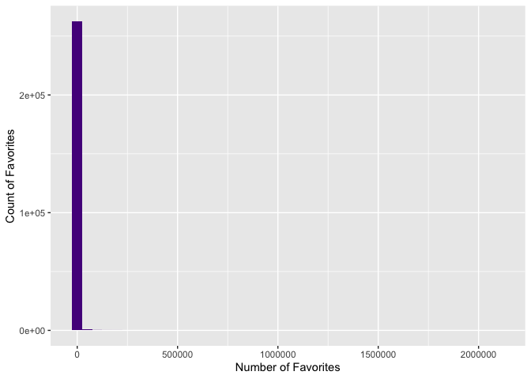
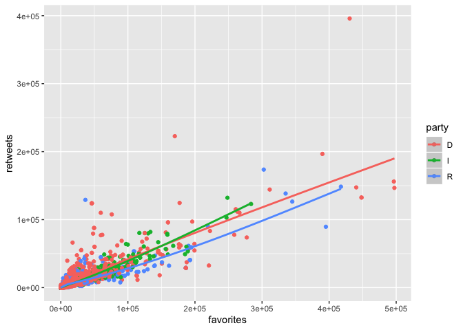

```r
library(ggmap)
library(ggridges)
library(ggthemes)
library(tidyverse)
```

# Politicians on Twitter

The code below will read in data on tweets from senators in the US. Only tweets with at least one favorite are included. The data is named `senators`. 


```r
url <- "https://raw.githubusercontent.com/fivethirtyeight/data/master/twitter-ratio/senators.csv"

senators <- read_csv(url) %>%
  mutate(
    party = as.factor(party),
    state = as.factor(state),
    created_at = as.POSIXct(created_at, tz = "GMT", format = "%m/%d/%Y %H:%M"),
    text =  gsub("[^\x01-\x7F]", "", text)) %>%
  select(created_at, user, everything(), -text, -url) %>% 
  filter(favorites>0)
```


(@) Create a histogram that examines the distribution of `favorites`. Do the following: a) Fill in the bars with a color, one that isn't too bright. b) Create helpful x and y axis labels. c) Use an appropriate number of bins or binsize.


```r
ggplot(data=senators)+
  geom_histogram(aes(x=favorites), fill='purple4', binwidth = 50000)+
  labs(x="Number of Favorites", y="Count of Favorites")
```

<!-- -->


(@) Modify the histogram from the previous problem so that the x-axis is on the log scale (HINT: use `scale_x_?????()`). What features do you see in this plot that were hard to see in the previous plot?


```r
ggplot(data=senators)+
  geom_histogram(aes(x=favorites), fill='purple4', bins = 50)+
  scale_x_log10()+
  labs(x="Number of Favorites(log10 scale)", y="Count of Favorites")
```

<!-- -->

```r
# In this figure, it is more clear for visualization of the frequency about the number of favorites, and the scale is much more appropriate to see the skewness or trend for this data set which contains the varied range and large numbers(few points are much larger than the bulk of the data). 
```


(@) Create a barplot that shows the number of tweets by party. 


```r
ggplot(senators)+
  geom_bar(aes(x=party))
```

<!-- -->


(@) Create a graph that examines the distribution of favorites by party. Use the log scale on the x-axis and label x and y axes appropriately.


```r
ggplot(senators, aes(x=favorites, fill=party))+
  geom_density()+
  scale_x_log10()+
  labs(x="Number of Favorites(log10 scale)", y="Density of Favorites")
```

<!-- -->


(@) We are going to filter the data to tweets with fewer than 500,000 favorites. Put the code into the R code chunk. Then pipe into your `ggplot` code and don't use a `data=` argument. Create a scatterplot to examine the relationship between favorites (x-axis) and retweets, and color the points by party. Add a smooth line for each party. Comment on what you observe.

```
senators %>% 
  filter(favorites < 500000)
```


```r
senators %>% 
  filter(favorites < 500000) %>% 
  ggplot(aes(x=favorites, y=retweets, color=party))+
  geom_point()+
  geom_smooth()
```

<!-- -->

```r
# Observation: overall, the trends of the relations between favorites and retweets of three parties are the same, which is an increasing relationship. 
```


# Cycling in Mallorca, Spain

The data below are from a bike ride I went on in Mallorca, Spain in spring of 2018.


```r
mallorca_bike_day7 <- read_csv("https://www.dropbox.com/s/zc6jan4ltmjtvy0/mallorca_bike_day7.csv?dl=1") %>% 
  select(1:4, speed)
```


(@) Plot the elevation (`ele`) over `time` and color by `speed`, using both points and a line to connect the points. When was I fastest? Slowest? What do you think happened around 12:45?


```r
ggplot(mallorca_bike_day7, aes(x=time, y=ele, color=speed))+
  geom_point()+
  geom_line()
```

<!-- -->

```r
# You were fast while going down(elevation decreased) and slow while going up(elevation increased). Approximately, you were fastest at 12:15 and slowest between 12:15 to 12:20(when speed is not zero). At 12:45, you probably stopped and rested.
```

(@) The following code creates the base map. On top of that, plot the route I took using the longitude (`lon`) and latitude (`lat`). Color them by elevation. Make the size of the points a little smaller to not overwhelm the map.


```r
mallorca_map <- get_stamenmap(
    bbox = c(left = 2.38, bottom = 39.55, right = 2.62, top = 39.7), 
    maptype = "terrain",
    zoom = 11
)

ggmap(mallorca_map)+
  geom_point(data=mallorca_bike_day7, 
             aes(x=lon,y=lat, color=ele), 
             alpha=.7, size = .5) +
  labs(x="Longitude", y="Latitude")
```

<!-- -->
